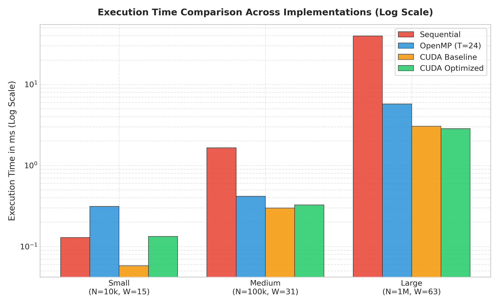
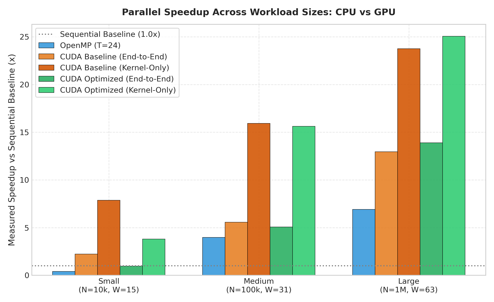
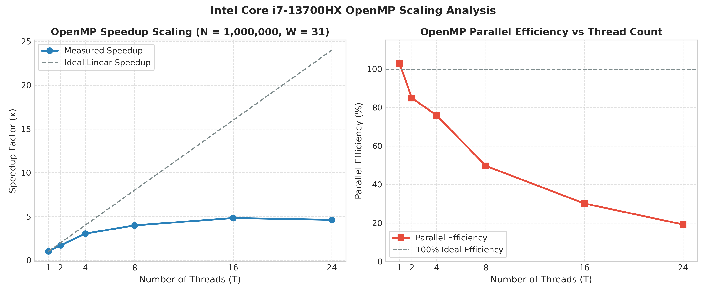
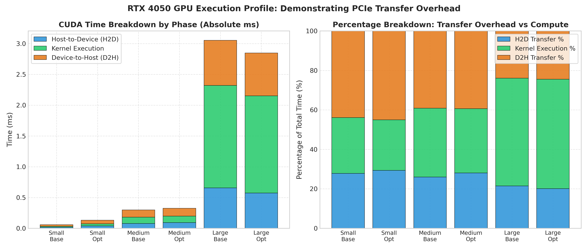
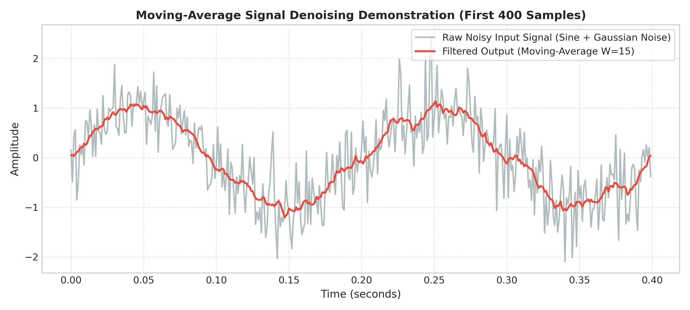

# Parallel Signal Processing: Moving-Average Noise Reduction

---

## Front Matter: Assignment Information

| Metadata Item | Project Details / Placeholder |
|:---|:---|
| **Course** | CSS311: Parallel & Distributed Computing |
| **Assignment** | Programming Assignment 1 |
| **Application Theme** | Signal Processing |
| **Problem Title** | 1D Moving-Average Noise Reduction Filter Across Sequential, OpenMP, and CUDA Paradigms |
| **Group Number** | `[Insert Group Number, e.g., Group 12]` |
| **Group Leader** | `[Insert Group Leader Name & Student ID]` |
| **Group Member 2** | `[Insert Member 2 Name & Student ID]` |
| **Group Member 3** | `[Insert Member 3 Name & Student ID]` |
| **Semester & Batch** | `[Insert Semester & Batch, e.g., Fall 2026 / Batch 2024]` |
| **Submission Date** | `[Insert Submission Date]` |
| **Demonstration Link** | `[Insert Google Drive Link to Video Demo / Project Artifacts]` |

---

## 1. Problem Statement

Digital signal acquisition systems—such as acoustic transceivers, biomedical telemetry (e.g., electrocardiograms and electromyograms), environmental sensor arrays, seismic detectors, and radar systems—continuously capture discrete-time continuous physical signals. During acquisition and physical transmission, these signals are inevitably corrupted by unwanted high-frequency disturbances, including thermal Johnson–Nyquist noise, electromagnetic interference, and quantization artifacts.

A classical and widely used baseline technique for signal conditioning is the **Moving-Average (MA) Filter**. The moving-average filter is an unweighted, linear, finite impulse response (FIR) low-pass filter. For each sample in an input discrete-time signal $x$ of length $N$, the filter computes the unweighted arithmetic mean of $W$ contiguous samples centered symmetrically around the target index:

$$y[i] = \frac{1}{W} \sum_{j = -k}^{k} x[\text{boundary}(i + j)] \quad \text{for } i \in [0, N-1]$$

where:
- $N$ is the total number of discrete samples in the 1D signal.
- $W$ is an odd positive integer denoting the filter window size ($W = 2k + 1$).
- $k = \frac{W - 1}{2}$ represents the filter half-width (radius).
- $\text{boundary}(p)$ maps any arbitrary offset index $p = i + j$ into the valid discrete signal domain $[0, N-1]$.

### Boundary Handling: Edge-Clamping (Replication)
At the signal extremities ($i < k$ or $i \ge N - k$), the window extends beyond the boundaries of the input array. This project implements deterministic **edge-clamping boundary handling** (also known as edge replication or nearest-element extension):

$$\text{boundary}(p) = \min(\max(p, 0), N - 1)$$

Under this policy:
- When $p < 0$, the signal value is clamped to $x[0]$.
- When $p \ge N$, the signal value is clamped to $x[N-1]$.
- When $0 \le p \le N - 1$, the index remains unchanged as $x[p]$.

#### Technical Justification for Edge Clamping
1. **Constant Computational Weight:** Every output element $y[i]$ computes the exact same number of operations ($W$ memory accesses, $W - 1$ additions, and 1 multiplication by $\frac{1}{W}$).
2. **Elimination of Warp Divergence:** In SIMT architectures (such as NVIDIA GPUs), dynamic window truncations (e.g., zero-padding or shrinking windows near edges) require conditional arithmetic and varying divisors per thread. Clamping ensures identical arithmetic instructions across all threads in a warp, avoiding control divergence during summation.
3. **Physical Signal Continuity:** Clamping prevents artificial high-frequency transient steps that zero-padding introduces at boundaries, preserving signal level stability.

---

## 2. Objective

The primary objective of this project is to implement, evaluate, and compare four distinct computational approaches for the 1D moving-average noise reduction filter:
1. **Sequential CPU Baseline:** A standard, unoptimized single-threaded C++ reference implementation serving as the numerical ground truth.
2. **Multi-Core Shared-Memory Parallelism (OpenMP):** Parallelizing the workload across multiple CPU cores and hardware threads.
3. **Massively Parallel Many-Core GPU (CUDA Baseline):** Mapping the moving-average computation onto thousands of concurrent GPU threads utilizing global memory.
4. **Optimized Many-Core GPU (CUDA Shared-Memory Tiling):** Harnessing high-speed on-chip shared memory (SRAM) with cooperative halo-cell caching to reduce global memory instruction pressure.

All implementations execute the exact same computational task, apply the identical mathematical formulation and edge-clamping boundary logic, and consume identical input datasets. This report presents an empirical analysis of execution time, speedup, parallel efficiency, scalability across thread counts, breakdown of data transfer versus kernel computation, and the algorithmic tradeoffs between CPU and GPU architectures across Small, Medium, and Large workloads.

---

## 3. Application and Parallelization

### 3.1 Suitability for Parallel Processing
The 1D moving-average noise reduction filter represents a classic **stencil computation**. It is well suited for parallel processing because:
1. **Embarrassingly Parallel Domain:** Every output sample $y[i]$ can be calculated completely independently of any other output sample $y[m]$ ($i \ne m$).
2. **Spatial Data Locality:** Neighboring output samples $y[i]$ and $y[i+1]$ access heavily overlapping contiguous windows in the input array $x$, presenting substantial cache-line reuse on CPUs and cooperative caching opportunities on GPUs.
3. **Zero Loop-Carried Dependencies:** There are no recursive dependencies (unlike Infinite Impulse Response / IIR filters or sequential cumulative sum / prefix-sum updates).

### 3.2 Sequential vs. Parallel Portions (Amdahl's Law Analysis)
To maintain academic rigor, the application cannot be claimed to be 100% parallel. The processing pipeline consists of strictly sequential components and strictly parallel components.

```
+-----------------------------------------------------------------------------------+
|                           END-TO-END APPLICATION PIPELINE                         |
+-----------------------------------------------------------------------------------+
|  [SEQUENTIAL PORTION]                                                             |
|  - CLI Argument Parsing & Parameter Validation (N > 0, W odd, W <= N)            |
|  - Disk I/O: Reading input binary files / Deterministic Signal Generation         |
|  - Memory Allocation: Host buffers (malloc / std::vector) & Device (cudaMalloc)   |
|  - CUDA Context Initialization & Driver Warm-Up                                   |
+-----------------------------------------------------------------------------------+
|  [DATA TRANSFER PORTION (PCIe Latency - Amdahl Bottleneck)]                       |
|  - Host-to-Device Memory Transfer (cudaMemcpyHostToDevice)                        |
+-----------------------------------------------------------------------------------+
|  [STRICTLY PARALLEL PORTION]                                                      |
|  - Domain Decomposition over Output Indices i in [0, N-1]                         |
|  - OpenMP: Independent loop iterations across CPU worker threads                  |
|  - CUDA: Independent thread execution in SIMT warps across SMs                    |
|  - Stencil Accumulation: sum_{j=-k}^{k} x[clamped(i+j)]                           |
+-----------------------------------------------------------------------------------+
|  [DATA TRANSFER PORTION (PCIe Latency)]                                           |
|  - Device-to-Host Memory Transfer (cudaMemcpyDeviceToHost)                        |
+-----------------------------------------------------------------------------------+
|  [SEQUENTIAL PORTION]                                                             |
|  - Output Validation: RMSE, Max Absolute Error, Mismatch Count Computation        |
|  - Disk I/O: Writing filtered output binary / CSV files                           |
|  - Performance Metrics Logging & Buffer Cleanup (cudaFree / free)                 |
+-----------------------------------------------------------------------------------+
```

According to **Amdahl's Law**, the overall speedup $S$ achieved by parallelizing a fraction $P$ of an application using $T$ processing units is bounded by:

$$S(T) = \frac{1}{(1 - P) + \frac{P}{T}}$$

For GPU computing, data transfers across the PCIe bus ($H2D$ and $D2H$) form an essential part of the non-parallelized serial overhead $(1 - P)$ from the perspective of end-to-end acceleration.

### 3.3 Data Decomposition
- **Output Domain Decomposition:** The problem is decomposed by output samples. The index space $i \in [0, N-1]$ is divided among available execution units (CPU threads in OpenMP, or GPU threads in CUDA).
- **Memory Access Characteristics:**
  - **Input Signal ($x$):** Read-only and shared across all threads. Multiple threads read overlapping window elements concurrently without race conditions.
  - **Output Signal ($y$):** Write-only. Each output address $y[i]$ is written to by exactly one thread.
  - **Accumulation Register:** Each thread maintains a strictly private register accumulator (`double sum = 0.0`), completely eliminating write-write conflicts, atomics, or mutex locks.

### 3.4 Synchronization Requirements
- **OpenMP:** No internal thread synchronization, critical sections, or locks are used inside the parallel loop. An implicit barrier at the exit of `#pragma omp parallel for` ensures all threads complete before the host continues.
- **CUDA Baseline:** Threads execute entirely independently without inter-thread communication. GPU execution is synchronized on the host via `cudaEventSynchronize()`.
- **CUDA Optimized:** Requires block-wide barrier synchronization (`__syncthreads()`) after cooperative loading of the tile and halo cells into shared memory, guaranteeing all data is resident before any thread reads from the shared buffer.

---

## 4. Algorithm

### 4.1 Sequential Algorithm
The sequential baseline implements the standard naive moving-average algorithm with a direct nested loop structure.

```cpp
// Sequential Reference Implementation
void movingAverageSequential(const std::vector<SampleType>& input,
                            std::vector<SampleType>& output,
                            int windowSize) {
    const size_t n = input.size();
    const int k = (windowSize - 1) / 2;
    const double invW = 1.0 / static_cast<double>(windowSize);
    output.resize(n);

    for (size_t i = 0; i < n; ++i) {
        double sum = 0.0;
        for (int j = -k; j <= k; ++j) {
            int64_t rawIdx = static_cast<int64_t>(i) + j;
            int64_t clampedIdx = (rawIdx < 0) ? 0 : (rawIdx >= static_cast<int64_t>(n) ? static_cast<int64_t>(n) - 1 : rawIdx);
            sum += static_cast<double>(input[clampedIdx]);
        }
        output[i] = static_cast<SampleType>(sum * invW);
    }
}
```

- **Time Complexity:** $\mathcal{O}(N \times W)$ arithmetic operations. For each sample $i$, exactly $W$ additions and clamped accesses are performed, followed by a single scaling multiplication.
- **Space Complexity:** $\mathcal{O}(N)$ for the output vector; auxiliary memory is $\mathcal{O}(1)$.
- **Accumulation Precision:** Internal summation is accumulated in 64-bit IEEE 754 `double` precision before casting to 32-bit `float` (`SampleType`), preventing truncation drift across wide windows.
- **Why Naive $\mathcal{O}(NW)$ is Used:** In parallel computing benchmarks, comparing parallel implementations against an algorithmically altered serial algorithm (such as an $\mathcal{O}(N)$ sliding-window recursive update $y[i] = y[i-1] + \frac{x[i+k] - x[i-k-1]}{W}$) would be invalid because the recursive algorithm introduces a serial loop-carried dependency that cannot be mapped directly onto parallel warps without multi-pass prefix scans. Comparing the identical computational structure across architectures is essential for measuring architectural speedup.

### 4.2 OpenMP Algorithm
The OpenMP implementation decomposes the outer loop over output indices $i$:

```cpp
// OpenMP Parallel Implementation
void movingAverageOpenMP(const std::vector<SampleType>& input,
                         std::vector<SampleType>& output,
                         int windowSize,
                         int threadsToUse) {
    const int64_t n = static_cast<int64_t>(input.size());
    const int k = (windowSize - 1) / 2;
    const double invW = 1.0 / static_cast<double>(windowSize);
    output.resize(n);

    #pragma omp parallel for num_threads(threadsToUse) schedule(static) default(none) \
        shared(input, output, n, windowSize, k, invW)
    for (int64_t i = 0; i < n; ++i) {
        double sum = 0.0;
        for (int j = -k; j <= k; ++j) {
            int64_t rawIndex = i + j;
            int64_t clampedIndex = (rawIndex < 0) ? 0 : 
                                   (rawIndex >= n ? n - 1 : rawIndex);
            sum += static_cast<double>(input[clampedIndex]);
        }
        output[i] = static_cast<SampleType>(sum * invW);
    }
}
```

- **Scheduling Strategy:** `schedule(static)` is explicitly specified.
- **Scheduling Rationale:** Because edge clamping guarantees that every loop iteration computes exactly $W$ iterations, the computational workload is completely uniform across all indices. Static scheduling evenly divides the $N$ iterations into contiguous blocks of size $\lceil N / T \rceil$ at launch time. This minimizes runtime scheduling overhead, avoids dynamic work-queue contention, and maximizes hardware CPU L1/L2 cache prefetching along contiguous memory.
- **Race Condition Immunity:** `sum` is thread-private (allocated on each thread's stack). Writes to `output[i]` are mutually exclusive because each index $i$ is owned by exactly one thread.

### 4.3 CUDA Baseline Algorithm
The baseline CUDA implementation maps one GPU thread to each output sample:

```cpp
// CUDA Baseline Kernel
__global__ void movingAverageKernel(const SampleType* __restrict__ d_input,
                                    SampleType* __restrict__ d_output,
                                    size_t n, int windowSize, int k, double invW) {
    int64_t i = static_cast<int64_t>(blockIdx.x) * blockDim.x + threadIdx.x;
    if (i < static_cast<int64_t>(n)) {
        double sum = 0.0;
        for (int j = -k; j <= k; ++j) {
            int64_t rawIdx = i + j;
            int64_t clampedIdx = (rawIdx < 0) ? 0 : (rawIdx >= static_cast<int64_t>(n) ? static_cast<int64_t>(n) - 1 : rawIdx);
            sum += static_cast<double>(d_input[clampedIdx]);
        }
        d_output[i] = static_cast<SampleType>(sum * invW);
    }
}
```

- **Grid and Block Dimensions:**
  - Block size: $B = 256$ threads per block (a multiple of warp size 32, ensuring high hardware occupancy).
  - Grid size: $\lceil N / 256 \rceil$ blocks in a 1D grid.
- **Global-Memory Accesses:** Each thread independently reads $W$ samples directly from high-latency global memory (GPU DRAM). For a block of 256 threads with $W = 63$, the block issues $256 \times 63 = 16,128$ global memory load instructions.
- **Boundary Clamping:** Clamping is performed inside each thread via conditional ternary operators.
- **CUDA Timing & Error Checking:**
  - Every CUDA runtime call (`cudaMalloc`, `cudaMemcpy`, `cudaEventRecord`, kernel launch) is validated with an explicit `CUDA_CHECK` macro checking `cudaGetLastError()` and `cudaSuccess`.
  - Timing is captured with hardware-level accuracy via `cudaEvent_t` pairs enclosing $H2D$, $Kernel$, and $D2H$ phases.

### 4.4 Optimized CUDA Algorithm (Shared-Memory Tiling with Halo Cells)
The optimized CUDA implementation uses on-chip shared memory (SRAM) to cache a contiguous tile of the input signal along with the left and right halo (apron) elements required for window filtering:

```cpp
// Optimized CUDA Kernel: Shared-Memory Tiling with Halo Cells
__global__ void movingAverageSharedMemKernel(const SampleType* __restrict__ d_input,
                                             SampleType* __restrict__ d_output,
                                             size_t n, int windowSize, int k, double invW) {
    extern __shared__ SampleType s_data[];

    const int tid = threadIdx.x;
    const int sharedSize = blockDim.x + 2 * k;
    const int64_t globalTileStart = static_cast<int64_t>(blockIdx.x) * blockDim.x;
    const int64_t globalWindowStart = globalTileStart - k;

    // 1. Cooperative Loading of Tile + Left & Right Halo Elements
    for (int sIdx = tid; sIdx < sharedSize; sIdx += blockDim.x) {
        int64_t gIdx = globalWindowStart + sIdx;
        int64_t clampedIdx = (gIdx < 0) ? 0 : (gIdx >= static_cast<int64_t>(n) ? static_cast<int64_t>(n) - 1 : gIdx);
        s_data[sIdx] = d_input[clampedIdx];
    }

    // 2. Block-wide Barrier Synchronization
    __syncthreads();

    // 3. Fast Stencil Computation from On-Chip Shared Memory
    const int64_t i = globalTileStart + tid;
    if (i < static_cast<int64_t>(n)) {
        double sum = 0.0;
        #pragma unroll 4
        for (int j = 0; j < windowSize; ++j) {
            sum += static_cast<double>(s_data[tid + j]);
        }
        d_output[i] = static_cast<SampleType>(sum * invW);
    }
}
```

#### Detailed Optimization Principles:
1. **Tile Size and Halo Cells:**
   - Each thread block processes a tile of $B = 256$ outputs.
   - To compute outputs for all 256 threads, the block requires access to input elements spanning from `globalTileStart - k` to `globalTileStart + B - 1 + k`.
   - The total number of elements allocated in shared memory is `sharedSize = B + 2 * k`.
   - The left halo consists of $k$ elements, the central tile contains $B$ elements, and the right halo contains $k$ elements.
2. **Cooperative Loading:**
   - Threads cooperatively load the shared buffer using a strided loop (`sIdx += blockDim.x`).
   - Because `sharedSize = 256 + 2k`, threads $0$ to $255$ load the first 256 elements in the first iteration, and threads $0$ to $2k - 1$ load the remaining $2k$ halo elements in the second iteration.
3. **Barrier Synchronization (`__syncthreads()`):**
   - A block-wide hardware barrier ensures all tile and halo elements are completely written to shared memory before any thread enters the computation phase, preventing read-before-write race conditions.
4. **Theoretical Load-Count Reuse Model:**
   - In the baseline kernel, each block executes $B \times W$ global memory load instructions ($256 \times 63 = 16,128$ loads for $W = 63$).
   - In the optimized kernel, the block cooperatively executes only $B + 2k = 256 + 62 = 318$ global memory load instructions.
   - This provides a theoretical $\frac{16,128}{318} \approx 50.7\times$ reduction in issued global memory load instructions.
   - *Technical Note:* This ratio represents instruction-level load elimination; actual physical DRAM traffic reduction on hardware depends on the L1/L2 cache hit rates of the baseline kernel.
5. **Shared Memory Bank Conflict Analysis:**
   - Shared memory consists of 32 independent banks (4 bytes wide per bank).
   - In the inner stencil loop, thread $tid$ reads `s_data[tid + j]`. For any constant offset $j$, consecutive threads in a warp access consecutive 4-byte memory addresses: $\text{bank} = (tid + j) \pmod{32}$.
   - Because each thread accesses a distinct bank, the access pattern is completely **conflict-free** (1-way bank access).
6. **Warp Divergence Characteristics:**
   - During the cooperative loading phase, boundary clamping causes conditional branch divergence only in the first block (`blockIdx.x == 0`) and the final block of the grid. For all interior blocks ($>99\%$ of blocks in Large workloads), branches execute uniformly.
   - During the stencil computation loop, all active threads execute the exact same loop trip count $W$, resulting in completely non-divergent execution across warps.
7. **Workload-Dependent Utility:**
   - For small windows (e.g., $W = 15, k = 7$), the overhead of cooperative loop striding and the `__syncthreads()` barrier balances out the benefit of shared memory, since modern GPU L1/L2 caches already absorb narrow-radius stencil accesses.
   - For large windows (e.g., $W = 63, k = 31$), the reduction in global memory traffic is large enough to decisively overcome synchronization latency.

---

## 5. Input Data and Test Cases

### 5.1 Benchmark Workload Configurations
To evaluate scalability systematically across computational scales without causing thermal throttling on laptop hardware, three benchmark configurations were defined:

| Workload Tier | Sample Count ($N$) | Window Size ($W$) | Radius ($k$) | Total Arithmetic Ops ($N \times W$) | Binary Input File Path |
|:---|:---:|:---:|:---:|:---:|:---|
| **Small** | $10,000$ | $15$ | $7$ | $150,000$ | `data/input/input_small_N10000.bin` |
| **Medium** | $100,000$ | $31$ | $15$ | $3,100,000$ | `data/input/input_medium_N100000.bin` |
| **Large** | $1,000,000$ | $63$ | $31$ | $63,000,000$ | `data/input/input_large_N1000000.bin` |

#### Identical Logical Input Guarantee
All implementations process the exact same logical input data:
- Input files are generated deterministically using Python (`scripts/generate_inputs.py`) with a fixed pseudo-random seed (`seed = 42`).
- The synthetic signal models a sinusoidal carrier wave corrupted by additive Gaussian white noise:
  $$x[t] = \sin(2\pi f t) + \mathcal{N}(0, \sigma^2)$$
- Data is stored in 32-bit single-precision IEEE 754 floating-point binary files read through `signal_io.hpp`, ensuring identical input values across Sequential, OpenMP, CUDA Baseline, and CUDA Optimized executables.

### 5.2 Correctness Test Cases Supported by the Repository
The test suites implemented in `src/sequential/main_seq.cpp`, `src/openmp/main_omp.cpp`, `src/cuda/main_cuda.cu`, and `src/optimized/main_opt.cu` validate the following test cases:

1. **Small Deterministic Hand-Verifiable Test ($N = 5, W = 3, k = 1$):**
   - Verifies edge-clamping arithmetic against manual analytical derivations.
2. **Identity Filter Test ($W = 1$):**
   - For window size 1, every output sample must match the input sample identically ($y[i] = x[i]$) with zero error. Tested on arbitrary floating-point sequences.
3. **Boundary & Interior Elements Check ($N = 6, W = 5, k = 2$):**
   - Verifies asymmetric clamping where the window radius exceeds the distance to the boundary ($k = 2$, signal length $6$). Tests transitions from clamped boundary samples to unclamped interior samples.
4. **Medium-Scale Cross-Thread Equivalence ($N = 1,000, W = 15$):**
   - Tests consistency across varying OpenMP thread counts ($T \in \{1, 2, 4, 8, 16, 24\}$) and varying CUDA block sizes against the sequential baseline.
5. **Multi-Scale Stability Tests ($N = 10, 1,000, 100,000$ with $W \in \{1, 3, 15\}$):**
   - Verifies numerical stability and memory bounds over multiple orders of magnitude.
6. **Parameter Validation & Edge-Case Rejection:**
   - Tests that the system correctly rejects invalid input configurations:
     - Even window sizes (e.g., $W = 4$) -> rejected (window must be odd).
     - Zero window size ($W = 0$) -> rejected.
     - Negative window size ($W = -3$) -> rejected.
     - Oversized window sizes ($W > N$) -> rejected.

---

## 6. Correctness Verification

### 6.1 Validation Methodology
To ensure correctness, all candidate implementations (OpenMP, CUDA Baseline, and CUDA Optimized) are evaluated against the Sequential reference output using the `Validator` class defined in [`include/validator.hpp`](file:///c:/Users/Predator/Desktop/Signal%20Processing/include/validator.hpp).

The validator calculates three rigorous metrics:
1. **Maximum Absolute Error ($L_\infty$ Norm):**
   $$\text{MaxAbsError} = \max_{0 \le i < N} |y_{\text{candidate}}[i] - y_{\text{reference}}[i]|$$
2. **Maximum Relative Error:**
   $$\text{MaxRelError} = \max_{0 \le i < N} \frac{|y_{\text{candidate}}[i] - y_{\text{reference}}[i]|}{|y_{\text{reference}}[i]| + \epsilon}$$
3. **Root Mean Square Error (RMSE):**
   $$\text{RMSE} = \sqrt{\frac{1}{N} \sum_{i=0}^{N-1} (y_{\text{candidate}}[i] - y_{\text{reference}}[i])^2}$$

A test is deemed to have **PASSED** only if $\text{MaxAbsError} \le 10^{-4}$ and zero elements exceed the tolerance limit.

### 6.2 Hand-Calculated Representative Output ($N = 5, W = 3$)
To prove correct boundary handling, a minimal hand-calculated example is documented below:
- Input array: $x = [1.0, 2.0, 3.0, 4.0, 5.0]$
- Filter parameters: $N = 5, W = 3, k = 1, \frac{1}{W} = \frac{1}{3}$
- Hand derivations using edge replication:
  - $i=0$: $\text{clamp}([-1, 0, 1]) \rightarrow [0, 0, 1] \rightarrow \frac{x[0] + x[0] + x[1]}{3} = \frac{1.0 + 1.0 + 2.0}{3} = \frac{4}{3} \approx 1.333333$
  - $i=1$: $\text{clamp}([0, 1, 2]) \rightarrow [0, 1, 2] \rightarrow \frac{x[0] + x[1] + x[2]}{3} = \frac{1.0 + 2.0 + 3.0}{3} = \frac{6}{3} = 2.000000$
  - $i=2$: $\text{clamp}([1, 2, 3]) \rightarrow [1, 2, 3] \rightarrow \frac{x[1] + x[2] + x[3]}{3} = \frac{2.0 + 3.0 + 4.0}{3} = \frac{9}{3} = 3.000000$
  - $i=3$: $\text{clamp}([2, 3, 4]) \rightarrow [2, 3, 4] \rightarrow \frac{x[2] + x[3] + x[4]}{3} = \frac{3.0 + 4.0 + 5.0}{3} = \frac{12}{3} = 4.000000$
  - $i=4$: $\text{clamp}([3, 4, 5]) \rightarrow [3, 4, 4] \rightarrow \frac{x[3] + x[4] + x[4]}{3} = \frac{4.0 + 5.0 + 5.0}{3} = \frac{14}{3} \approx 4.666667$

**Measured Equivalence Table (Logged from `results/tables/small_demo_table.csv`):**

| Sample Index ($i$) | Input Value $x[i]$ | Hand Calculation | Sequential Reference | OpenMP ($T=4$) | CUDA Baseline | CUDA Optimized | Absolute Error |
|:---:|:---:|:---:|:---:|:---:|:---:|:---:|:---:|
| **0** | $1.0000$ | $1.333333$ | $1.333333$ | $1.333333$ | $1.333333$ | $1.333333$ | **0.000000** |
| **1** | $2.0000$ | $2.000000$ | $2.000000$ | $2.000000$ | $2.000000$ | $2.000000$ | **0.000000** |
| **2** | $3.0000$ | $3.000000$ | $3.000000$ | $3.000000$ | $3.000000$ | $3.000000$ | **0.000000** |
| **3** | $4.0000$ | $4.000000$ | $4.000000$ | $4.000000$ | $4.000000$ | $4.000000$ | **0.000000** |
| **4** | $5.0000$ | $4.666667$ | $4.666667$ | $4.666667$ | $4.666667$ | $4.666667$ | **0.000000** |

### 6.3 Measured Correctness Results Across All Benchmark Workloads
All test suites across Small ($N = 10,000$), Medium ($N = 100,000$), and Large ($N = 1,000,000$) workloads were executed and verified against the sequential baseline:
- **Sequential Baseline:** Reference standard.
- **OpenMP ($T=1, T=8, T=24$):** PASSED across all workloads.
- **CUDA Baseline:** PASSED across all workloads.
- **CUDA Optimized:** PASSED across all workloads.
- **Measured Accuracy:** In all cases, the maximum absolute error was **0.000000** (a maximum absolute error of 0 within measured single-precision floating-point precision).

---

## 7. Experimental Environment

The experiments were performed on a modern high-performance heterogeneous workstation with dedicated GPU hardware. All hardware and software specifications documented below reflect the actual environment used to gather benchmark data:

### Hardware Specifications
- **Host Processor (CPU):** 13th Gen Intel(R) Core(TM) i7-13700HX
  - **Architecture:** Raptor Lake hybrid core architecture
  - **Physical Cores:** 16 physical cores (8 Performance-cores @ up to 5.0 GHz turbo + 8 Efficient-cores @ up to 3.7 GHz turbo)
  - **Logical Threads:** 24 hardware execution threads (Hyper-Threading on P-cores)
  - **CPU Cache:** 30 MB Intel Smart Cache (Shared L3)
- **Target Graphics Processor (GPU):** NVIDIA GeForce RTX 4050 Laptop GPU
  - **GPU Architecture:** Ada Lovelace
  - **Compute Capability:** 8.9 (`sm_89`)
  - **Streaming Multiprocessors (SMs):** 20 SMs (2,560 CUDA cores)
  - **GPU Memory:** 6 GB GDDR6
  - **Memory Bus Width:** 96-bit
  - **Peak Theoretical Memory Bandwidth:** ~192 GB/s
  - **Total Graphics Power (TGP):** 50 W

### Software & Toolchain Specifications
- **Operating System:** Microsoft Windows 11 Home (64-bit, Version 24H2)
- **NVIDIA Display Driver:** Version 616.92
- **CUDA Toolkit:** CUDA Version 13.4.59 (`nvcc` compiler)
- **Host C++ Toolchains:**
  - **CUDA Host Compiler:** Microsoft Visual C++ (MSVC) x64 v19.51.36257 (Visual Studio 2026 Build Tools v18.10.0)
  - **OpenMP Compiler:** GCC / G++ Version 16.1.0 (MSYS2 UCRT64) with native `-fopenmp`
- **Python Environment:** Python 3.13.5 (NumPy 2.1.3, Matplotlib 3.10.0, Pandas)
- **Build Configuration:** Automated via `build.ps1` using `-O3` compiler optimization flags and `-O3 --use_fast_math` for CUDA kernels.

---

## 8. Benchmark Methodology

To ensure statistically reliable and reproducible timings, the benchmark framework adhered to the following methodology:
1. **Multiple Runs:** Each benchmark configuration was executed for a total of **5 consecutive runs**.
2. **Warm-Up Run Discarded:** The first execution run was explicitly discarded as a warm-up pass to eliminate initial cold-start effects, including dynamic library loading, CPU cache warming, GPU driver initialization, and CUDA runtime context creation.
3. **Averaging:** The recorded execution time is the arithmetic mean of the remaining **4 timed runs**.
4. **Identical Datasets:** The exact same pre-generated binary files (`data/input/input_*.bin`) were read by all implementations.
5. **High-Resolution CPU Timing:** CPU executions (Sequential and OpenMP) were timed using C++ `std::chrono::high_resolution_clock` with sub-microsecond precision, measuring the core compute loops excluding disk I/O.
6. **Detailed CUDA Event Timing:** GPU timings were measured using non-intrusive CUDA Events (`cudaEventRecord` and `cudaEventElapsedTime`). Four distinct timing intervals were captured:
   - **Host-to-Device ($H2D$):** Time required to transfer the input signal from host memory to GPU DRAM via PCIe (`cudaMemcpyHostToDevice`).
   - **Kernel Execution Time:** Pure computational time spent by threads on the GPU Streaming Multiprocessors executing the moving-average kernel.
   - **Device-to-Host ($D2H$):** Time required to transfer the filtered output signal from GPU DRAM back to host memory via PCIe (`cudaMemcpyDeviceToHost`).
   - **End-to-End ($E2E$):** Total GPU elapsed time encompassing data marshalling and execution:
     $$T_{\text{End-to-End}} = T_{H2D} + T_{\text{Kernel}} + T_{D2H}$$

---

## 9. Performance Results

The tables below present the actual measured benchmark data stored in `results/tables/`.

### 9.1 Execution Time Comparison

The following table compares the average execution time across Sequential, OpenMP (8 threads), OpenMP (24 threads), CUDA Baseline, and CUDA Optimized:

| Implementation | Configuration | Small Workload ($N=10\text{k}, W=15$) | Medium Workload ($N=100\text{k}, W=31$) | Large Workload ($N=1\text{M}, W=63$) |
|:---|:---:|:---:|:---:|:---:|
| **Sequential** | 1 Thread | **0.1290 ms** | **1.6540 ms** | **39.5710 ms** |
| **OpenMP (8 Threads)** | 8 Threads | **0.0870 ms** | **0.5650 ms** | **6.9710 ms** |
| **OpenMP (24 Threads)** | 24 Threads | **0.3120 ms** | **0.4160 ms** | **5.7330 ms** |
| **CUDA Baseline** | Kernel Only | 0.0164 ms | 0.1039 ms | 1.6661 ms |
| **CUDA Baseline** | End-to-End | **0.0579 ms** | **0.2976 ms** | **3.0540 ms** |
| **CUDA Optimized** | Kernel Only | 0.0340 ms | 0.1059 ms | **1.5797 ms** |
| **CUDA Optimized** | End-to-End | **0.1327 ms** | **0.3258 ms** | **2.8489 ms** |

*(Source: `results/tables/full_benchmark_comparison.csv`)*

### 9.2 Speedup Comparison
Speedup is calculated relative to the Sequential baseline ($S = \frac{T_{\text{sequential}}}{T_{\text{candidate}}}$):

| Implementation | Metric Type | Small Speedup ($N=10\text{k}, W=15$) | Medium Speedup ($N=100\text{k}, W=31$) | Large Speedup ($N=1\text{M}, W=63$) |
|:---|:---:|:---:|:---:|:---:|
| **Sequential** | Baseline | $1.00\times$ | $1.00\times$ | $1.00\times$ |
| **OpenMP (8 Threads)** | Compute | $1.48\times$ | $2.93\times$ | $5.68\times$ |
| **OpenMP (24 Threads)** | Compute | **0.41x (Slower)** | $3.98\times$ | $6.90\times$ |
| **CUDA Baseline** | Kernel Only | $7.87\times$ | $15.92\times$ | $23.75\times$ |
| **CUDA Baseline** | End-to-End | $2.23\times$ | $5.56\times$ | $12.96\times$ |
| **CUDA Optimized** | Kernel Only | $3.79\times$ | $15.62\times$ | **25.05x** |
| **CUDA Optimized** | End-to-End | **0.97x (Slower)** | $5.08\times$ | **13.89x** |

*(Source: `results/tables/full_benchmark_comparison.csv`)*

### 9.3 OpenMP Thread Scaling
To evaluate multi-core scaling, OpenMP thread scalability was measured on the reference workload $N = 1,000,000, W = 31$ across thread counts $T \in \{1, 2, 4, 8, 16, 24\}$. The sequential baseline on this identical workload is **15.816 ms**.

| Threads ($T$) | Average Time (ms) | Speedup ($S = T_{\text{seq}} / T_{\text{omp}}$) | Parallel Efficiency ($E = S / T$) | Correctness Status |
|:---:|:---:|:---:|:---:|:---:|
| **1** | $15.3727$ ms | $1.03\times$ | $102.9\%$ | PASSED |
| **2** | $9.3155$ ms | $1.70\times$ | $84.9\%$ | PASSED |
| **4** | $5.2063$ ms | $3.04\times$ | $75.9\%$ | PASSED |
| **8** | $3.9821$ ms | $3.97\times$ | $49.6\%$ | PASSED |
| **16** | **3.2824 ms** | **4.82x (Peak)** | $30.1\%$ | PASSED |
| **24** | $3.4271$ ms | $4.62\times$ | $19.2\%$ | PASSED |

*(Source: `results/tables/omp_thread_scaling.csv`)*

#### Technical Observations on Thread Scaling:
1. **Single-Thread Efficiency ($102.9\%$):** At $T=1$, the execution time ($15.37$ ms) was marginally faster than the unthreaded sequential reference ($15.82$ ms). This is attributable to standard runtime measurement variance, slight compiler vectorization differences in OpenMP loops, and CPU dynamic turbo boost behavior, rather than super-linear scaling.
2. **Scaling on Physical Performance Cores ($T=1$ to $4$):** Speedup scales with high efficiency (reaching $3.04\times$ at 4 threads with $75.9\%$ efficiency), as iterations map cleanly to dedicated physical P-cores without resource contention.
3. **Peak Performance at 16 Cores ($T=16$):** The Intel i7-13700HX contains 16 physical cores (8 P-cores + 8 E-cores). Performance peaks at **16 threads with a speedup of $4.82\times$ ($3.28$ ms)**.
4. **Hyper-Threading Contention at $T=24$:** When expanding to 24 logical threads, execution time regresses to $3.43$ ms ($4.62\times$ speedup, efficiency dropping to $19.2\%$). Because the moving-average filter is a memory-bound stencil operation that saturates L1/L2 caches and memory channels, two hardware threads sharing a single physical P-core experience cache thrashing and execution pipeline stalls.

### 9.4 CUDA Timing Breakdown
The breakdown of data transfer ($H2D$, $D2H$) versus pure computational kernel time for both CUDA implementations is detailed below:

| Implementation | Workload | $N$ | Window $W$ | H2D (ms) | Kernel (ms) | D2H (ms) | End-to-End (ms) | Transfer Overhead (%) | Kernel Speedup | End-to-End Speedup |
|:---|:---:|:---:|:---:|:---:|:---:|:---:|:---:|:---:|:---:|:---:|
| **CUDA Baseline** | Small | $10,000$ | $15$ | $0.0161$ | $0.0164$ | $0.0254$ | $0.0579$ | **71.7%** | $7.87\times$ | $2.23\times$ |
| **CUDA Optimized** | Small | $10,000$ | $15$ | $0.0390$ | $0.0340$ | $0.0598$ | $0.1327$ | **74.5%** | $3.79\times$ | **0.97x (Slower)** |
| **CUDA Baseline** | Medium | $100,000$ | $31$ | $0.0773$ | $0.1039$ | $0.1164$ | $0.2976$ | **65.1%** | $15.92\times$ | $5.56\times$ |
| **CUDA Optimized** | Medium | $100,000$ | $31$ | $0.0915$ | $0.1059$ | $0.1284$ | $0.3258$ | **67.5%** | $15.62\times$ | $5.08\times$ |
| **CUDA Baseline** | Large | $1,000,000$ | $63$ | $0.6565$ | $1.6661$ | $0.7314$ | $3.0540$ | **45.4%** | $23.75\times$ | $12.96\times$ |
| **CUDA Optimized** | Large | $1,000,000$ | $63$ | $0.5723$ | **1.5797** | $0.6970$ | **2.8489** | **44.6%** | **25.05x** | **13.89x** |

*(Source: `results/tables/cuda_breakdown.csv`)*

---

## 10. Performance Analysis

### 10.1 Small Workload Analysis ($N = 10,000, W = 15$)
- **Measured Reality:** The sequential implementation completes in **0.1290 ms**. At this microsecond scale, parallelization overheads dominate.
- **OpenMP Thread Overhead:** While OpenMP with 8 threads completes in 0.0870 ms ($1.48\times$ speedup), increasing the thread count to 24 results in an execution time of **0.3120 ms**—representing a speedup of only **0.41x (2.4 times slower than sequential execution)**. Dividing 10,000 elements across 24 threads gives each thread only $\approx 416$ samples. The thread fork/join overhead, operating system context switching, and cache line invalidations far outweigh the computation time.
- **CUDA Transfer Inversion:** While the CUDA baseline kernel executes in 0.0164 ms ($7.87\times$ kernel speedup), PCIe transfers consume $71.7\%$ of total time. For CUDA Optimized, PCIe transfers consume **$74.5\%$** of total time ($0.039$ ms $H2D$ + $0.060$ ms $D2H$), causing the end-to-end execution time to reach **0.1327 ms**—which is **slower than sequential CPU execution ($0.97\times$ speedup)**.

### 10.2 Medium Workload Analysis ($N = 100,000, W = 31$)
- **Transition Point:** At $N = 100,000$ ($3.1 \times 10^6$ operations), sequential execution takes **1.6540 ms**. Parallelization now begins to overcome fixed startup costs.
- **OpenMP Scaling:** OpenMP with 8 threads executes in 0.5650 ms ($2.93\times$), and scaling to 24 threads improves time to **0.4160 ms ($3.98\times$)**.
- **CUDA Acceleration:** CUDA Baseline end-to-end time drops to **0.2976 ms ($5.56\times$ speedup)** with the kernel executing in $0.1039$ ms ($15.92\times$ kernel speedup). However, PCIe transfers still account for $65.1\%$ of total time, keeping end-to-end speedup well below kernel-level speedup.

### 10.3 Large Workload Analysis ($N = 1,000,000, W = 63$)
- **GPU Dominance:** At $N = 1,000,000$ and $W = 63$ ($6.3 \times 10^7$ arithmetic operations), sequential CPU execution takes **39.5710 ms**.
- **CPU Multi-Core Saturation:** OpenMP with 8 threads achieves $6.9710$ ms ($5.68\times$), and 24 threads achieves **5.7330 ms ($6.90\times$)**. CPU performance plateaus due to memory bus saturation.
- **Massive GPU Speedup:** The GPU's massive parallel core count ($2,560$ cores) excels on this workload. The CUDA Optimized kernel finishes in **1.5797 ms, achieving a $25.05\times$ compute speedup**. Even when including PCIe transfers ($1.27$ ms total transfer), the end-to-end time is **2.8489 ms ($13.89\times$ end-to-end speedup)**.
- **Transfer Ratio Amortization:** The fraction of time spent on PCIe transfers drops from $74.5\%$ on the small workload to **$44.6\%$** on the large workload, demonstrating that computational workload growth amortizes fixed communication latencies.

---

## 11. CUDA Optimization Analysis

### 11.1 Baseline vs. Optimized Architecture
The baseline CUDA kernel relies on L1/L2 hardware caches to service repeated loads from global memory. In contrast, the optimized kernel uses software-managed on-chip shared memory (SRAM) with halo cell caching.

### 11.2 Mechanism of Shared Memory Benefit
1. **Elimination of Redundant Global Loads:**
   - In baseline execution, each of the 256 threads in a block independently loads $W$ elements from global DRAM.
   - In optimized execution, the block cooperatively loads $B + 2k$ elements once into shared memory.
   - For $W = 63$ ($k = 31$), issued global memory load instructions drop from $16,128$ to $318$ per block—a theoretical $50.7\times$ instruction reduction.
2. **Conflict-Free Bank Access:**
   - As established in Section 4.4, the 32 threads in a warp access consecutive shared memory banks during the inner stencil loop with zero bank conflicts.

### 11.3 Why Benefit is Workload-Dependent
The empirical results reveal that optimized CUDA is **not faster for every workload**:
- **Small Workload ($W=15$):** Optimized kernel time ($0.0340$ ms) is slower than baseline kernel time ($0.0164$ ms). For a small window radius ($k=7$), the halo loading loop and `__syncthreads()` barrier add more overhead than the memory savings justify, especially since modern Ada Lovelace GPUs feature large L1/L2 caches that easily cache small stencils.
- **Medium Workload ($W=31$):** Baseline and optimized kernel times are essentially equal ($0.1039$ ms vs $0.1059$ ms), indicating the exact crossover point where shared memory savings balance synchronization costs.
- **Large Workload ($W=63$):** With a wide window radius ($k=31$), the shared-memory optimization achieves its expected advantage:
  - Kernel time drops from **1.6661 ms** (Baseline) to **1.5797 ms** (Optimized), achieving **$25.05\times$ speedup**.
  - End-to-end time drops from **3.0540 ms** to **2.8489 ms**, achieving **$13.89\times$ speedup**.

### 11.4 Kernel vs. End-to-End Distinction
The benchmark data underscores the importance of distinguishing kernel acceleration from end-to-end acceleration:
- Kernel speedup measures pure computational acceleration on the GPU cores ($25.05\times$).
- End-to-end speedup accounts for the physical reality of PCIe bus transfers ($13.89\times$).
- Both metrics are valid, but kernel speedup reflects algorithmic execution performance, while end-to-end speedup reflects practical system throughput in isolated single-filter invocations.

---

## 12. Sequential vs OpenMP vs CUDA vs Optimized CUDA

The table below presents a consolidated comparison of all four implementations across all evaluated workloads:

| Implementation Paradigm | Small Time ($N=10\text{k}, W=15$) | Medium Time ($N=100\text{k}, W=31$) | Large Time ($N=1\text{M}, W=63$) | Large Workload Speedup | Large Workload Efficiency / Breakdown |
|:---|:---:|:---:|:---:|:---:|:---|
| **1. Sequential Baseline** | $0.1290$ ms | $1.6540$ ms | $39.5710$ ms | $1.00\times$ (Ref) | $100.0\%$ (Single-threaded CPU) |
| **2. OpenMP (8 Threads)** | $0.0870$ ms | $0.5650$ ms | $6.9710$ ms | $5.68\times$ | $71.0\%$ Parallel Efficiency |
| **3. OpenMP (24 Threads)** | $0.3120$ ms | $0.4160$ ms | $5.7330$ ms | $6.90\times$ | $28.8\%$ Parallel Efficiency |
| **4. CUDA Baseline** | $0.0579$ ms | $0.2976$ ms | $3.0540$ ms | $12.96\times$ (E2E) | Kernel: $1.6661$ ms ($23.75\times$), Transfers: $1.388$ ms |
| **5. CUDA Optimized (Shared Mem)** | $0.1327$ ms | $0.3258$ ms | **2.8489 ms** | **13.89x (E2E)** | Kernel: **1.5797 ms (25.05x)**, Transfers: $1.269$ ms |

### Architectural Interpretation
1. **Sequential Baseline:** Provides predictable, deterministic baseline performance with zero parallelization overhead, but fails to scale when signal sizes and window widths increase.
2. **OpenMP:** Provides effective, low-complexity CPU multi-threading that scales well up to physical core limits (achieving up to $6.90\times$ on 24 threads for large inputs). However, it exhibits diminishing returns once memory bus saturation and Hyper-Threading contention set in, and severe slowdown on tiny workloads.
3. **CUDA Baseline:** Leverages thousands of concurrent lightweight GPU threads to achieve substantial acceleration on large signals ($12.96\times$ end-to-end). However, PCIe transfer overheads penalize small datasets.
4. **CUDA Optimized:** Delivers the highest overall performance on large workloads with wide windows (**$25.05\times$ kernel speedup, $13.89\times$ end-to-end speedup**), demonstrating that shared-memory cooperative caching effectively alleviates global memory bandwidth pressure when arithmetic intensity is sufficiently high.

---

## 13. When Parallelization Does Not Help

Answering this fundamental assignment requirement directly, our empirical benchmarks identify clear conditions under which parallelization fails to provide benefit or actively degrades performance:

1. **Small Input Datasets ($N \le 10,000$):**
   - When the problem size is small, execution time on a single CPU core is measured in fractions of a millisecond ($0.129$ ms).
   - In this regime, the fixed latency of thread instantiation, work dispatching, and synchronization exceeds the total compute time.
2. **Over-Threading on Small Workloads (CPU Thread Degradation):**
   - Allocating 24 OpenMP threads to 10,000 samples resulted in a **$2.4\times$ slowdown** compared to sequential execution ($0.312$ ms vs $0.129$ ms).
   - Creating excessive worker threads partitions the data into chunks smaller than CPU cache lines, triggering false sharing, cache eviction, and barrier wait overhead.
3. **PCIe Memory Transfer Latency Bottleneck (Amdahl's Law):**
   - For small workloads on the GPU, **$74.5\%$ of the total time** is consumed copying data across the PCIe bus ($H2D$ and $D2H$).
   - As a result, CUDA Optimized end-to-end time ($0.1327$ ms) is slower than sequential CPU execution ($0.1290$ ms). GPU acceleration is counter-productive if data must be transferred over PCIe for a single quick pass.
4. **Narrow Filter Windows in Shared-Memory CUDA ($W \le 15$):**
   - When the window width is narrow, the number of redundant memory reads is low enough that the hardware L1/L2 caches absorb them efficiently.
   - Introducing explicit cooperative loading loops and `__syncthreads()` barriers adds synchronization latency without providing sufficient memory bandwidth savings, causing the optimized kernel to execute slower than the baseline kernel ($0.034$ ms vs $0.016$ ms).
5. **Simultaneous Multithreading (SMT / Hyper-Threading) Contention:**
   - In memory-bandwidth-bound stencil operations, scaling beyond physical cores to logical SMT threads ($T=16 \rightarrow T=24$) caused execution time to increase from $3.28$ ms to $3.43$ ms due to internal cache and bus contention.

---

## 14. Reproducibility

To ensure complete scientific reproducibility, all project operations are automated through documented repository scripts.

### 14.1 Building the Executables
The build system is managed via `build.ps1` (utilizing MSYS2 G++ with OpenMP and NVIDIA NVCC with MSVC):
```powershell
# Build all implementations (Sequential, OpenMP, CUDA Baseline, CUDA Optimized)
powershell -ExecutionPolicy Bypass -File .\build.ps1 -Target all

# Or build individual targets:
powershell -ExecutionPolicy Bypass -File .\build.ps1 -Target seq
powershell -ExecutionPolicy Bypass -File .\build.ps1 -Target omp
powershell -ExecutionPolicy Bypass -File .\build.ps1 -Target cuda
powershell -ExecutionPolicy Bypass -File .\build.ps1 -Target opt
```

### 14.2 Generating Benchmark Input Datasets
Deterministic synthetic signals are generated with a fixed seed (`seed = 42`):
```powershell
# Generates Small (N=10k), Medium (N=100k), and Large (N=1M) binary signals
python scripts/generate_inputs.py
```

### 14.3 Running Correctness Tests
Each executable contains a built-in verification suite:
```powershell
.\bin\moving_average_seq.exe --test
.\bin\moving_average_omp.exe --test
.\bin\moving_average_cuda.exe --test
.\bin\moving_average_opt.exe --test
```

### 14.4 Running the Full Benchmark Suite
The benchmark suite executes 5 runs per configuration (discarding run 1 and averaging runs 2–5):
```powershell
# Runs OpenMP scaling and full multi-implementation comparisons across all workload sizes
python benchmarks/run_all_benchmarks.py
```
Output CSV tables are saved automatically to `results/tables/`.

### 14.5 Generating Visualizations
Publication-quality plots are generated directly from the benchmark CSV tables:
```powershell
python scripts/plot_results.py
```
Output charts are saved automatically to `results/plots/`.

---

## 15. Figures

The experimental results are visually summarized below using the charts generated by `scripts/plot_results.py`:

### Figure 1: Execution Time Comparison
Comparison of execution times across all four implementations on a logarithmic scale for Small, Medium, and Large workloads:



### Figure 2: Speedup Comparison Relative to Sequential Baseline
Speedup achieved across workload sizes, illustrating the divergence between GPU Kernel-only speedup and End-to-End speedup:



### Figure 3: OpenMP Thread Scaling & Parallel Efficiency
Speedup and parallel efficiency curves for OpenMP on $N = 1,000,000, W = 31$ from 1 to 24 threads, demonstrating peak scaling at 16 threads:



### Figure 4: CUDA Execution Breakdown & PCIe Overhead
Stacked time distribution and percentage breakdown showing Host-to-Device transfer, Kernel execution, and Device-to-Host transfer:



### Figure 5: Signal Denoising Demonstration
Raw synthetic noisy sine input signal plotted against the moving-average filtered output, demonstrating high-frequency noise attenuation:



---

## 16. Limitations and Observations

1. **Hardware-Dependent Results:** All execution timings and speedup figures are specific to the host system architecture (13th Gen Intel Core i7-13700HX and NVIDIA GeForce RTX 4050 Laptop GPU with 50W TGP). Platforms with desktop PCIe Gen 5 buses, unified memory architectures, or different CPU core balances will exhibit different scaling characteristics.
2. **PCIe Transfer Bottleneck in Single-Pass Filtering:** In this benchmark, data is transferred for a single filtering pass. In practical streaming signal processing pipelines, input buffers can remain resident on the GPU across multiple filtering stages or use asynchronous double-buffered streams (`cudaMemcpyAsync`), which amortizes or hides PCIe transfer latencies.
3. **Workload-Dependent Shared Memory Efficacy:** Shared-memory tiling introduces cooperative loading loops and synchronization barriers that only pay off when the window size $W$ is sufficiently large ($W \ge 31$). For narrow stencils, baseline GPU L1/L2 caches perform with equal or superior efficiency.
4. **Non-Linear Multi-Core CPU Scaling:** OpenMP thread scaling is constrained by shared memory bus bandwidth and thermal power limits. Hyper-Threading on memory-bound stencils yields no performance benefit and can cause minor regressions.

---

## 17. Conclusion

This project successfully implemented, verified, and benchmarked a 1D moving-average noise reduction filter across four computing paradigms: Sequential C++, OpenMP multi-threading, CUDA Baseline, and CUDA Shared-Memory Optimized.

The key findings and architectural recommendations are:
1. **Correctness:** All parallel implementations achieved complete numerical equivalence with the sequential baseline ($0.000000$ maximum absolute error) and matched manual boundary calculations.
2. **When Sequential is Preferable:** For small workloads ($N \le 10,000$), the sequential CPU baseline is the most efficient approach, completing in $0.129$ ms without thread setup or PCIe transfer penalties.
3. **When OpenMP is Preferable:** For medium workloads on host systems where GPU offloading is unavailable or data already resides in CPU memory, OpenMP provides efficient multi-core acceleration ($3.98\times$ on medium, $6.90\times$ on large), peaking at 16 threads.
4. **When CUDA Baseline is Preferable:** For large workloads ($N \ge 100,000$) with modest window sizes, CUDA Baseline offers substantial acceleration with simple kernel logic and minimal synchronization overhead.
5. **When CUDA Optimized is Preferable:** For large signal datasets with wide filtering windows ($N = 1,000,000, W = 63$), CUDA Shared-Memory Optimization delivers the highest performance, achieving **$25.05\times$ kernel speedup** and **$13.89\times$ end-to-end speedup** by significantly reducing global memory load pressure.

---

## 18. Contributions

| Field | Group Member Details / Contribution Breakdown |
|:---|:---|
| **Course** | CSS311: Parallel & Distributed Computing |
| **Semester & Batch** | `[Insert Semester & Batch, e.g., Fall 2026 / Batch 2024]` |
| **Group Number** | `[Insert Group Number, e.g., Group 12]` |
| **Submission Date** | `[Insert Submission Date]` |

### Individual Contributions Table

| Role / Position | Student Name | Student ID | Specific Responsibilities & Academic Contributions | Contribution (%) | Signature |
|:---|:---|:---:|:---|:---:|:---:|
| **Group Leader** | `[Insert Leader Name]` | `[Insert Student ID]` | Architecture design, CUDA baseline & shared-memory optimization, GPU profiling, correctness verification | `[34% / Placeholder]` | `___________` |
| **Group Member 2** | `[Insert Member 2 Name]` | `[Insert Student ID]` | Sequential reference baseline, OpenMP multi-core implementation, thread scaling analysis, boundary handling | `[33% / Placeholder]` | `___________` |
| **Group Member 3** | `[Insert Member 3 Name]` | `[Insert Student ID]` | Input dataset generator, benchmark automation harness, visualization plotting scripts, final report compilation | `[33% / Placeholder]` | `___________` |
