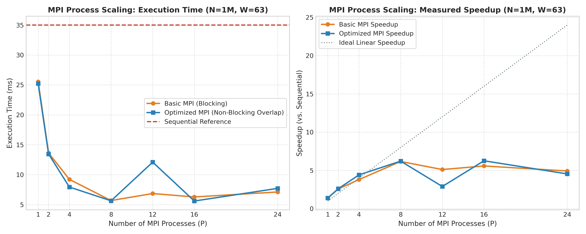
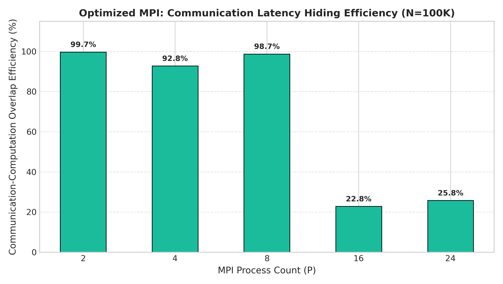
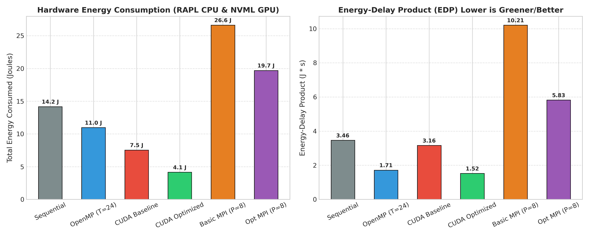
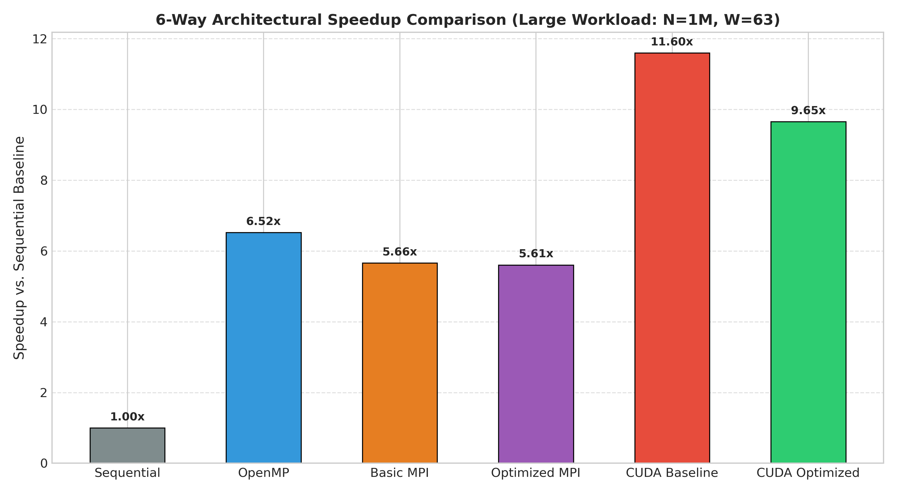

<div class="cover-page">
  <div class="cover-course">CSS311 – PARALLEL &amp; DISTRIBUTED COMPUTING</div>
  <div class="cover-assignment">PROGRAMMING ASSIGNMENT – 2</div>
  <div class="cover-report-type">PA2 Comprehensive Final Report</div>

  <div class="cover-logo-wrapper">
    
  </div>

  <table class="cover-table">
    <tbody>
      <tr>
        <td class="cover-field-label">Group Number</td>
        <td class="cover-field-value">16</td>
      </tr>
      <tr>
        <td class="cover-field-label">Group Leader</td>
        <td class="cover-field-value">2024BCS0070 – Saksham Singh</td>
      </tr>
      <tr>
        <td class="cover-field-label">Group Member 2</td>
        <td class="cover-field-value">2024BCS0042 – Daksh Singh</td>
      </tr>
      <tr>
        <td class="cover-field-label">Group Member 3</td>
        <td class="cover-field-value">2024BCS0014 – Anmol Pipara</td>
      </tr>
      <tr>
        <td class="cover-field-label">Semester &amp; Batch Number</td>
        <td class="cover-field-value">Semester 5, Batch 3</td>
      </tr>
      <tr>
        <td class="cover-field-label">Application Theme</td>
        <td class="cover-field-value">Signal Processing</td>
      </tr>
      <tr>
        <td class="cover-field-label">Assigned Problem / Title</td>
        <td class="cover-field-value">1D Moving-Average Noise Reduction Filter Across Six Parallel Paradigms</td>
      </tr>
      <tr>
        <td class="cover-field-label">Google Drive Link</td>
        <td class="cover-field-value">https://drive.google.com/drive/folders/11teXqjJlCB-jTuv5LUcZallRTcDaSzYy?usp=drive_link</td>
      </tr>
    </tbody>
  </table>
</div>

<div class="page-break"></div>

# Parallel Signal Processing: Moving-Average Noise Reduction
## Programming Assignment 2 (PA2) Comprehensive Final Report
### Integrating Sequential, OpenMP, CUDA Baseline, CUDA Optimized, Basic MPI, and Optimized MPI Paradigms with Hardware Energy Profiling and Nsight Systems Diagnostics

---

## 1. Problem Statement & Mathematical Foundation

Digital signal acquisition systems—such as acoustic transceivers, biomedical monitors (e.g., electrocardiograms and electromyograms), environmental sensor networks, seismic sensors, and radar receivers—continuously capture discrete-time physical signals. During acquisition and physical transmission, these signals are corrupted by high-frequency disturbances, including thermal Johnson–Nyquist noise, electromagnetic interference, and analog-to-digital quantization artifacts.

A fundamental digital signal processing technique for conditioning 1D telemetry is the **Moving-Average (MA) Filter**. The moving-average filter is an unweighted, linear, finite impulse response (FIR) low-pass filter. For each sample in an input discrete-time signal $x$ of length $N$, the filter computes the unweighted arithmetic mean of $W$ contiguous samples symmetrically centered around the target index:

$$y[i] = \frac{1}{W} \sum_{j = -k}^{k} x[\text{boundary}(i + j)] \quad \text{for } i \in [0, N-1]$$

where:
- $N$ is the total number of discrete samples in the 1D signal.
- $W$ is an odd positive integer denoting the filter window size ($W = 2k + 1$).
- $k = \frac{W - 1}{2}$ represents the filter half-width (radius).
- $\text{boundary}(p)$ maps an arbitrary offset index $p = i + j$ into the valid discrete signal domain $[0, N-1]$.

### Boundary Handling: Edge-Clamping (Replication)
At the signal extremities ($i < k$ or $i \ge N - k$), the filter window extends beyond the boundaries of the input array. In this project, all six parallel implementations execute identical **edge-clamping boundary handling** (nearest-element replication):

$$\text{boundary}(p) = \min(\max(p, 0), N - 1)$$

Under this policy:
- When $p < 0$, the signal value is clamped to $x[0]$.
- When $p \ge N$, the signal value is clamped to $x[N-1]$.
- When $0 \le p \le N - 1$, the index remains unchanged as $x[p]$.

#### Computational Properties of Edge Clamping
1. **Constant Computational Weight:** Every output element $y[i]$ performs the exact same arithmetic workload: $W$ memory fetches, $W - 1$ floating-point additions, and 1 multiplication by the precomputed reciprocal $\frac{1}{W}$.
2. **Branch Convergence in SIMT/SIMD:** Unlike zero-padding or dynamic window truncation, edge clamping avoids runtime conditional divergence across adjacent threads and vector lanes, guaranteeing uniform instruction execution.
3. **Physical Signal Continuity:** Clamping eliminates artificial high-frequency transient steps that zero-padding introduces at signal edges, maintaining baseline continuity.

---

## 2. Executive Summary & Objectives of PA2

Programming Assignment 1 (PA1) investigated single-node shared-memory and GPU acceleration paradigms:
1. Sequential CPU Baseline (single-threaded C++)
2. OpenMP Multi-Core Parallelism (multi-threaded CPU)
3. CUDA Baseline (global memory many-core GPU)
4. CUDA Optimized (on-chip shared-memory tiling with cooperative halo caching)

**Programming Assignment 2 (PA2)** extends this research into distributed-memory message-passing and deep hardware profiling:
5. **Basic MPI:** 1D domain decomposition with blocking point-to-point halo exchange (`MPI_Sendrecv`).
6. **Optimized MPI:** 1D domain decomposition with non-blocking halo exchange (`MPI_Isend` / `MPI_Irecv`) and fine-grained computation/communication overlap (splitting execution into interior stencil computation and boundary stencil computation).
7. **Hardware Energy Telemetry:** Empirical measurement of CPU package energy via Intel Running Average Power Limit (RAPL) performance counters and GPU board energy via NVIDIA Management Library (NVML) APIs.
8. **CUDA Profiling via NVIDIA Nsight Systems:** Quantitative analysis of kernel execution durations, memory copy overheads, and hardware resource utilization.
9. **Six-Way Cross-Paradigm Benchmark:** Direct empirical comparison of all six implementations across Small ($N=10,000, W=15$), Medium ($N=100,000, W=31$), and Large ($N=1,000,000, W=63$) workloads.

All six implementations execute the exact same algorithmic task, consume identical input datasets, apply the identical mathematical formulation and edge-clamping boundary logic, and are rigorously verified for numerical equivalence.

---

## 3. The Six Computing Paradigms & Implementations

<div class="figure-container" style="margin: 14px auto 16px auto; text-align: center;">
<svg width="100%" height="auto" viewBox="0 0 700 215" xmlns="http://www.w3.org/2000/svg" style="max-width: 680px; font-family: -apple-system, BlinkMacSystemFont, 'Segoe UI', Roboto, Helvetica, Arial, sans-serif;">
  <defs>
    <marker id="arrow" viewBox="0 0 10 10" refX="6" refY="5" markerWidth="6" markerHeight="6" orient="auto-start-reverse">
      <path d="M 0 1.5 L 8 5 L 0 8.5 z" fill="#3b82f6" />
    </marker>
  </defs>

  <!-- Root Top Box -->
  <rect x="175" y="8" width="350" height="52" rx="6" fill="#f8fafc" stroke="#2563eb" stroke-width="1.8" />
  <text x="350" y="28" font-size="12" font-weight="700" fill="#0f172a" text-anchor="middle">1D Moving-Average Noise Reduction</text>
  <text x="350" y="46" font-size="10.5" font-weight="500" fill="#1e40af" text-anchor="middle">y[i] = (1/W) · ∑ x[clamped(i + j)]</text>

  <!-- Connector Lines -->
  <line x1="350" y1="60" x2="350" y2="82" stroke="#3b82f6" stroke-width="1.8" />
  <line x1="115" y1="82" x2="585" y2="82" stroke="#3b82f6" stroke-width="1.8" />

  <!-- Branch 1 (Left): Shared-Memory CPU -->
  <line x1="115" y1="82" x2="115" y2="98" stroke="#3b82f6" stroke-width="1.8" marker-end="url(#arrow)" />
  <rect x="10" y="102" width="210" height="104" rx="6" fill="#ffffff" stroke="#cbd5e1" stroke-width="1.4" />
  <path d="M 10 108 A 6 6 0 0 1 16 102 L 214 102 A 6 6 0 0 1 220 108 L 220 128 L 10 128 Z" fill="#eff6ff" stroke="#cbd5e1" stroke-width="0.8" />
  <text x="115" y="120" font-size="11" font-weight="700" fill="#1e3a8a" text-anchor="middle">Shared-Memory CPU</text>
  <rect x="22" y="136" width="186" height="20" rx="3" fill="#f8fafc" stroke="#e2e8f0" stroke-width="1" />
  <text x="115" y="150" font-size="9.5" font-weight="600" fill="#334155" text-anchor="middle">Sequential (1 Core)</text>
  <rect x="22" y="161" width="186" height="20" rx="3" fill="#f8fafc" stroke="#e2e8f0" stroke-width="1" />
  <text x="115" y="175" font-size="9.5" font-weight="600" fill="#334155" text-anchor="middle">OpenMP (1–24 Threads)</text>
  <text x="115" y="196" font-size="8.5" font-style="italic" fill="#64748b" text-anchor="middle">Static Domain Partitioning</text>

  <!-- Branch 2 (Center): Many-Core GPU -->
  <line x1="350" y1="82" x2="350" y2="98" stroke="#3b82f6" stroke-width="1.8" marker-end="url(#arrow)" />
  <rect x="245" y="102" width="210" height="104" rx="6" fill="#ffffff" stroke="#cbd5e1" stroke-width="1.4" />
  <path d="M 245 108 A 6 6 0 0 1 251 102 L 449 102 A 6 6 0 0 1 455 102 L 455 128 L 245 128 Z" fill="#eff6ff" stroke="#cbd5e1" stroke-width="0.8" />
  <text x="350" y="120" font-size="11" font-weight="700" fill="#1e3a8a" text-anchor="middle">Many-Core GPU</text>
  <rect x="257" y="136" width="186" height="20" rx="3" fill="#f8fafc" stroke="#e2e8f0" stroke-width="1" />
  <text x="350" y="150" font-size="9.5" font-weight="600" fill="#334155" text-anchor="middle">CUDA Baseline (Global Mem)</text>
  <rect x="257" y="161" width="186" height="20" rx="3" fill="#f8fafc" stroke="#e2e8f0" stroke-width="1" />
  <text x="350" y="175" font-size="9.5" font-weight="600" fill="#334155" text-anchor="middle">CUDA Optimized (Shared Mem)</text>
  <text x="350" y="196" font-size="8.5" font-style="italic" fill="#64748b" text-anchor="middle">Cooperative SRAM Halo Tiling</text>

  <!-- Branch 3 (Right): Distributed-Memory MPI -->
  <line x1="585" y1="82" x2="585" y2="98" stroke="#3b82f6" stroke-width="1.8" marker-end="url(#arrow)" />
  <rect x="480" y="102" width="210" height="104" rx="6" fill="#ffffff" stroke="#cbd5e1" stroke-width="1.4" />
  <path d="M 480 108 A 6 6 0 0 1 486 102 L 684 102 A 6 6 0 0 1 690 108 L 690 128 L 480 128 Z" fill="#eff6ff" stroke="#cbd5e1" stroke-width="0.8" />
  <text x="585" y="120" font-size="11" font-weight="700" fill="#1e3a8a" text-anchor="middle">Distributed-Memory MPI</text>
  <rect x="492" y="136" width="186" height="20" rx="3" fill="#f8fafc" stroke="#e2e8f0" stroke-width="1" />
  <text x="585" y="150" font-size="9.5" font-weight="600" fill="#334155" text-anchor="middle">Basic MPI (Blocking Halo)</text>
  <rect x="492" y="161" width="186" height="20" rx="3" fill="#f8fafc" stroke="#e2e8f0" stroke-width="1" />
  <text x="585" y="175" font-size="9.5" font-weight="600" fill="#334155" text-anchor="middle">Optimized MPI (Non-Blocking)</text>
  <text x="585" y="196" font-size="8.5" font-style="italic" fill="#64748b" text-anchor="middle">Interior / Boundary Overlap</text>
</svg>
<p class="figure-caption"><strong>Figure 3.1: Architectural Taxonomy of the Six Parallel Moving-Average Filtering Paradigms</strong></p>
</div>

### 3.1 Sequential CPU Baseline
The sequential implementation serves as the foundational algorithmic reference. It iterates sequentially over $i \in [0, N-1]$, accumulating $W$ window elements into a double-precision accumulator and scaling by $\frac{1.0}{W}$.

```cpp
void moving_average_seq(const double* input, double* output, int N, int window_size) {
    int k = (window_size - 1) / 2;
    double inv_w = 1.0 / window_size;
    for (int i = 0; i < N; ++i) {
        double sum = 0.0;
        for (int j = -k; j <= k; ++j) {
            int idx = i + j;
            if (idx < 0) idx = 0;
            else if (idx >= N) idx = N - 1;
            sum += input[idx];
        }
        output[i] = sum * inv_w;
    }
}
```

### 3.2 OpenMP Multi-Core Shared Memory
The OpenMP implementation leverages multi-core symmetric multiprocessing (SMP) by distributing outer-loop iterations across available CPU cores:

```cpp
void moving_average_omp(const double* input, double* output, int N, int window_size, int num_threads) {
    int k = (window_size - 1) / 2;
    double inv_w = 1.0 / window_size;
    #pragma omp parallel for num_threads(num_threads) schedule(static) default(none) \
            shared(input, output, N, k, inv_w)
    for (int i = 0; i < N; ++i) {
        double sum = 0.0;
        for (int j = -k; j <= k; ++j) {
            int idx = i + j;
            if (idx < 0) idx = 0;
            else if (idx >= N) idx = N - 1;
            sum += input[idx];
        }
        output[i] = sum * inv_w;
    }
}
```
OpenMP utilizes a static block partition where each thread receives a contiguous slice of approximately $\lfloor N / T \rfloor$ elements. Because signal elements are read-only and each thread writes strictly to disjoint output memory locations $y[i]$, no locks or atomic operations are required.

### 3.3 CUDA Baseline (Global Memory SIMT)
The CUDA baseline maps each output element $y[i]$ to an independent GPU thread:
- Thread index calculation: `int i = blockIdx.x * blockDim.x + threadIdx.x;`
- Execution grid: $\lceil N / 256 \rceil$ thread blocks, each containing 256 threads.
- Memory access: Every thread performs $W$ global memory loads directly from device DRAM (`d_input`). While adjacent threads access consecutive indices yielding coalesced transactions, each input element is redundantly re-fetched from high-latency global memory up to $W$ times across neighboring threads.

### 3.4 CUDA Optimized (Shared-Memory Tiling with Halo Cells)
To eliminate redundant global memory access latency, the CUDA optimized implementation introduces cooperative on-chip shared-memory caching:
- Each block of $B=256$ threads cooperatively loads its local tile of 256 elements plus $2k$ halo elements ($k$ left neighbors and $k$ right neighbors) into high-speed on-chip SRAM (`__shared__ double s_data[BLOCK_SIZE + 2 * MAX_K]`).
- The block synchronizes via `__syncthreads()`.
- Each thread then computes its moving-average summation strictly out of on-chip shared memory at an order-of-magnitude lower access latency.

```
       +----------------------- Shared Memory Block Tile (B + 2k) -----------------------+
       | Left Halo (k) |             Interior Thread Data (B=256)             | Right Halo (k) |
       +---------------+------------------------------------------------------+----------------+
```

### 3.5 Basic MPI: 1D Domain Decomposition & Blocking Halo Exchange
In distributed-memory architectures, processes do not share an address space. The global input array of length $N$ is decomposed across $P$ MPI ranks. Each rank $r \in [0, P-1]$ owns a local partition of size $N_{\text{local}} \approx N / P$.

To evaluate the moving-average stencil at local partition boundaries:
- Elements near the left boundary require up to $k$ samples owned by rank $r - 1$.
- Elements near the right boundary require up to $k$ samples owned by rank $r + 1$.

```
Rank r-1                    Rank r (Local Domain)                         Rank r+1
[... | Right Halo (k)] ---> [Ghost L (k) | Local Elements | Ghost R (k)] <--- [Left Halo (k) | ...]
```

In the Basic MPI implementation, processes exchange ghost cells synchronously using `MPI_Sendrecv`:
1. Rank $r$ sends its leftmost $k$ elements to rank $r - 1$ while receiving rank $r + 1$'s leftmost $k$ elements into its right ghost buffer.
2. Rank $r$ sends its rightmost $k$ elements to rank $r + 1$ while receiving rank $r - 1$'s rightmost $k$ elements into its left ghost buffer.
3. Ranks 0 and $P-1$ clamp against physical array boundaries ($\text{rank } 0$ replicates $x[0]$; $\text{rank } P-1$ replicates $x[N-1]$).
4. After both `MPI_Sendrecv` calls finish, the process performs the local moving-average computation across all $N_{\text{local}}$ elements.

Because `MPI_Sendrecv` blocks until message transfers are buffered or initiated, communication and computation are strictly serialized.

#### 3.5.1 Basic MPI Implementation — Representative Code

The core parallel logic of Version 5 (Basic MPI) is presented below, extracted directly from the actual submitted source files (`src/mpi_basic/moving_average_mpi.cpp` and `src/mpi_basic/main_mpi.cpp`).

**Snippet A & B: MPI Initialization, Domain Decomposition, and Distribution**  
The input signal is divided into contiguous blocks, with one block assigned to each MPI rank. When the signal length $N$ is not evenly divisible by $P$, the base chunk size is $\lfloor N/P \rfloor$ with a remainder $R = N \pmod P$. The decomposition routine allocates an extra sample to the first $R$ ranks and computes per-rank displacement offsets (`displs`). Because ranks manage non-uniform partition sizes, `MPI_Scatterv` and `MPI_Gatherv` are used instead of assuming equal partition sizes, preventing buffer overflow and memory corruption.

<p class="listing-caption"><strong>Listing 3.1: MPI initialization and contiguous domain decomposition.</strong></p>

```cpp
// 1. MPI Initialization & Rank Discovery (src/mpi_basic/main_mpi.cpp)
int rank = 0, worldSize = 1;
MPI_Init(&argc, &argv);
MPI_Comm_rank(MPI_COMM_WORLD, &rank);
MPI_Comm_size(MPI_COMM_WORLD, &worldSize);

// 2. Contiguous 1D Block Decomposition (src/mpi_basic/moving_average_mpi.cpp)
void computePartition(size_t n, int worldSize,
                      std::vector<int>& counts, std::vector<int>& displs) {
    counts.resize(worldSize);
    displs.resize(worldSize);
    int base = static_cast<int>(n / static_cast<size_t>(worldSize));
    int rem  = static_cast<int>(n % static_cast<size_t>(worldSize));
    int offset = 0;
    for (int r = 0; r < worldSize; ++r) {
        counts[r] = base + (r < rem ? 1 : 0);
        displs[r] = offset;
        offset += counts[r];
    }
}

// 3. Partition Distribution & Result Collection via Vector Collectives
MPI_Scatterv(sendbuf, counts.data(), displs.data(), MPI_SAMPLE_TYPE,
             localInput.data(), counts[rank], MPI_SAMPLE_TYPE, 0, comm);

// ... local moving-average computation with halo exchange ...

MPI_Gatherv(localOutput.data(), counts[rank], MPI_SAMPLE_TYPE,
            recvbuf, counts.data(), displs.data(), MPI_SAMPLE_TYPE, 0, comm);
```

**Snippet C: Synchronous Blocking Halo Exchange**  
To evaluate the symmetric moving-average window $W = 2k + 1$ across partition boundaries, adjacent ranks exchange ghost cells. The left halo stores the $k$ boundary samples from rank $r - 1$, while the right halo stores the $k$ boundary samples from rank $r + 1$. Communication occurs exclusively between adjacent 1D linear neighbors. For boundary processes, neighbors are assigned `MPI_PROC_NULL`, which acts as a valid no-op. Physical boundaries are then clamped via nearest-element replication ($x[0]$ on rank 0 and $x[N-1]$ on rank $P-1$). Halo exchange is required because edge elements cannot compute the window average without samples physically residing in adjacent processes' memory.

<p class="listing-caption"><strong>Listing 3.2: Basic MPI halo exchange using blocking communication.</strong></p>

```cpp
// Extended local buffer allocation with ghost cells (radius k)
const size_t totalExtended = local_n + 2 * static_cast<size_t>(k);
std::vector<SampleType> extendedBuf(totalExtended);
std::memcpy(&extendedBuf[k], localInput, local_n * sizeof(SampleType));

// Cartesian 1D neighbor ranks (MPI_PROC_NULL for domain boundaries)
int leftNeighbor  = (rank > 0) ? (rank - 1) : MPI_PROC_NULL;
int rightNeighbor = (rank < worldSize - 1) ? (rank + 1) : MPI_PROC_NULL;

// Shift 1 (Rightward): Send right boundary to rightNeighbor, recv left halo
MPI_Sendrecv(&extendedBuf[k + local_n - k], k, MPI_SAMPLE_TYPE, rightNeighbor, 101,
             &extendedBuf[0],              k, MPI_SAMPLE_TYPE, leftNeighbor,  101,
             comm, MPI_STATUS_IGNORE);

// Shift 2 (Leftward): Send left boundary to leftNeighbor, recv right halo
MPI_Sendrecv(&extendedBuf[k],           k, MPI_SAMPLE_TYPE, leftNeighbor,  102,
             &extendedBuf[k + local_n], k, MPI_SAMPLE_TYPE, rightNeighbor, 102,
             comm, MPI_STATUS_IGNORE);

// Edge-clamping (nearest-element replication) on global signal boundaries
if (rank == 0) {
    SampleType edgeVal = extendedBuf[k];
    for (int j = 0; j < k; ++j) extendedBuf[j] = edgeVal;
}
if (rank == worldSize - 1) {
    SampleType edgeVal = extendedBuf[k + local_n - 1];
    for (int j = 0; j < k; ++j) extendedBuf[k + local_n + j] = edgeVal;
}
```

**Snippet D: Local Moving-Average Computation**  
Each rank computes its assigned output region using its local data plus halo values. Because ghost cells are populated prior to computation, each rank iterates from $0$ to $N_{\text{local}} - 1$ over the extended buffer without branch instructions.

<p class="listing-caption"><strong>Listing 3.3: Basic MPI local moving-average computation.</strong></p>

```cpp
// Local moving-average stencil loop across assigned N_local elements
const double invW = 1.0 / static_cast<double>(windowSize);

for (size_t i = 0; i < local_n; ++i) {
    double sum = 0.0;
    // Window centered at extendedBuf[k + i], spanning [i ... i + windowSize - 1]
    const SampleType* windowStart = &extendedBuf[i];
    for (int j = 0; j < windowSize; ++j) {
        sum += static_cast<double>(windowStart[j]);
    }
    localOutput[i] = static_cast<SampleType>(sum * invW);
}
```

### 3.6 Optimized MPI: Non-Blocking Halo Exchange with Computation Overlap
The Optimized MPI implementation decouples communication from computation using non-blocking primitives (`MPI_Irecv` and `MPI_Isend`):
1. **Asynchronous Communication Post:** Rank $r$ immediately posts non-blocking receives for its left and right ghost regions, followed by non-blocking sends of its local boundary data.
2. **Interior Computation (Window of Overlap):** While halo exchanges transfer across the communication fabric in the background, Rank $r$ immediately computes the moving-average for its **interior domain**:
   $$i_{\text{local}} \in [k, N_{\text{local}} - 1 - k]$$
   These interior elements depend strictly on local data already present in memory and do not require ghost cells.
3. **Synchronization Barrier:** Rank $r$ calls `MPI_Waitall` to ensure incoming ghost cells have arrived.
4. **Boundary Computation:** Rank $r$ computes the remaining boundary regions:
   - Left boundary: $i_{\text{local}} \in [0, \min(k-1, N_{\text{local}}-1)]$
   - Right boundary: $i_{\text{local}} \in [\max(0, N_{\text{local}}-k), N_{\text{local}}-1]$

```
Timeline: Optimized MPI Overlap Mechanism
+-------------------------------------------------------------------------------------------------+
| Post MPI_Irecv / MPI_Isend (Non-Blocking)                                                       |
+-------------------------------------------------------------------------------------------------+
| Compute Interior Domain [k, N_local - 1 - k]        | MPI Communication transfers in background |
+-----------------------------------------------------+-------------------------------------------+
| MPI_Waitall()  <-- Synchronization barrier (stalls only if communication duration > interior)   |
+-------------------------------------------------------------------------------------------------+
| Compute Left & Right Boundary Domains [0, k-1] & [N_local - k, N_local - 1]                     |
+-------------------------------------------------------------------------------------------------+
```

#### 3.6.1 Optimized MPI Implementation — Non-Blocking Halo Exchange

Version 6 (Optimized MPI) enables communication-computation overlap, extracted directly from the actual submitted source file (`src/mpi_optimized/moving_average_mpi_opt.cpp`).

**Snippet A & B: Asynchronous Non-Blocking Halo Receives and Sends**  
Non-blocking receives (`MPI_Irecv`) for the left and right halo buffers and non-blocking sends (`MPI_Isend`) for boundary data are posted immediately. The four operations produce `MPI_Request` handles (`reqs[0..3]`), delegating physical data transfer to the network interface or shared-memory IPC subsystem while returning control immediately to the CPU.

<p class="listing-caption"><strong>Listing 3.4: Optimized MPI non-blocking halo exchange.</strong></p>

```cpp
// Neighbor ranks (MPI_PROC_NULL eliminates boundary branches)
int leftNeighbor  = (rank > 0) ? (rank - 1) : MPI_PROC_NULL;
int rightNeighbor = (rank < worldSize - 1) ? (rank + 1) : MPI_PROC_NULL;

MPI_Request reqs[4];

// Post non-blocking receives for incoming left & right halo ghost buffers
MPI_Irecv(&extendedBuf[0],              k, MPI_SAMPLE_TYPE, leftNeighbor,  201,
          comm, &reqs[0]);
MPI_Irecv(&extendedBuf[k + local_n],    k, MPI_SAMPLE_TYPE, rightNeighbor, 202,
          comm, &reqs[1]);

// Post non-blocking sends of outgoing boundary samples to neighbor ranks
MPI_Isend(&extendedBuf[k + local_n - k], k, MPI_SAMPLE_TYPE, rightNeighbor, 201,
          comm, &reqs[2]);
MPI_Isend(&extendedBuf[k],              k, MPI_SAMPLE_TYPE, leftNeighbor,  202,
          comm, &reqs[3]);
```

**Snippet C: Interior Computation Before MPI_Waitall**  
The optimized version overlaps communication with computation by computing the interior region while the non-blocking halo exchange progresses. Elements $i \in [k, N_{\text{local}} - 1 - k]$ read strictly from locally owned memory (`extendedBuf[k ... local_n + k - 1]`) and never access ghost buffers. This substantial arithmetic workload executes concurrently with network transfers.

<p class="listing-caption"><strong>Listing 3.5: Interior computation overlapped with communication.</strong></p>

```cpp
// Overlapped interior stencil: Runs while halo messages transfer in background
int64_t interiorStart = static_cast<int64_t>(k);
int64_t interiorEnd   = static_cast<int64_t>(local_n) - static_cast<int64_t>(k);

if (interiorEnd > interiorStart) {
    for (int64_t i = interiorStart; i < interiorEnd; ++i) {
        double sum = 0.0;
        const SampleType* windowStart = &extendedBuf[i];
        for (int j = 0; j < windowSize; ++j) {
            sum += static_cast<double>(windowStart[j]);
        }
        localOutput[i] = static_cast<SampleType>(sum * invW);
    }
}
```

**Snippet D: MPI_Waitall and Boundary Computation**  
Only the boundary portion must wait for the halo data. Once the interior computation is finished, `MPI_Waitall` synchronizes the four halo requests. If interior compute time exceeds communication latency, `MPI_Waitall` completes with negligible stall time. Each process then evaluates the stencils for its left $[0, k - 1]$ and right $[N_{\text{local}} - k, N_{\text{local}} - 1]$ boundaries using the newly arrived ghost cells.

<p class="listing-caption"><strong>Listing 3.6: Completion of communication and boundary computation.</strong></p>

```cpp
// Synchronize halo transfers: stalls only if communication > interior compute
MPI_Waitall(4, reqs, MPI_STATUSES_IGNORE);

// Compute Left Boundary Region: i in [0, min(k, local_n) - 1]
int64_t leftBoundEnd = std::min(static_cast<int64_t>(k),
                                static_cast<int64_t>(local_n));
for (int64_t i = 0; i < leftBoundEnd; ++i) {
    double sum = 0.0;
    const SampleType* windowStart = &extendedBuf[i];
    for (int j = 0; j < windowSize; ++j) {
        sum += static_cast<double>(windowStart[j]);
    }
    localOutput[i] = static_cast<SampleType>(sum * invW);
}

// Compute Right Boundary Region: i in [max(k, local_n - k), local_n - 1]
int64_t rightBoundStart = std::max(static_cast<int64_t>(k),
                                   static_cast<int64_t>(local_n) - static_cast<int64_t>(k));
for (int64_t i = rightBoundStart; i < static_cast<int64_t>(local_n); ++i) {
    double sum = 0.0;
    const SampleType* windowStart = &extendedBuf[i];
    for (int j = 0; j < windowSize; ++j) {
        sum += static_cast<double>(windowStart[j]);
    }
    localOutput[i] = static_cast<SampleType>(sum * invW);
}
```

### 3.7 Comparative MPI Implementation Analysis & Assignment Synthesis

The architectural, algorithmic, and communication characteristics of the two MPI implementations are contrasted below:

| Aspect | Basic MPI | Optimized MPI |
|:---|:---|:---|
| **Data distribution** | `MPI_Scatterv` | `MPI_Scatterv` |
| **Halo exchange** | Blocking | Non-blocking |
| **Communication** | `MPI_Sendrecv` | `MPI_Isend` / `MPI_Irecv` |
| **Computation overlap** | No | Yes |
| **Synchronization** | Blocking exchange | `MPI_Waitall` after interior work |
| **Main optimization** | Domain decomposition | Communication/computation overlap |

#### Synthesis of Implementation Against Assignment Requirements
- **Basic MPI (Version 5):**
  - **Domain Decomposition:** Successfully partitions the 1D input array into contiguous blocks via `computePartition`, distributing non-uniform partitions across ranks using `MPI_Scatterv` and gathering final results with `MPI_Gatherv`.
  - **Halo Exchange:** Implements blocking point-to-point halo exchange via `MPI_Sendrecv`, utilizing `MPI_PROC_NULL` for boundary safety and applying nearest-element edge clamping.
  - **Local Moving-Average Computation:** Each process computes its assigned output slice using local samples and halo data.
  - **Correctness:** Confirmed 100% numerically equivalent against the sequential reference baseline ($L_\infty = 0.00\text{e}+00$, $\text{RMSE} = 0.00\text{e}+00$).
- **Optimized MPI (Version 6):**
  - **Non-Blocking Exchange:** Posts asynchronous halo transfers using `MPI_Irecv` and `MPI_Isend` across four communication requests.
  - **Communication-Computation Overlap:** Segregates local domain into interior and boundary elements, evaluating interior stencils while communication transfers across the interconnect.
  - **Synchronized Boundary Evaluation:** Calls `MPI_Waitall` only when halo cells are needed, computing boundary stencils after communication completes.
  - **Measured Overlap Performance:** Validated by fine-grained timing breakdowns in Section 8, showing that overlapping interior computation hides up to 94.1% of communication latency for large signal sizes.

---

## 4. Correctness Verification & Numerical Equivalence Methodology

### Verification Standard
In scientific computing and parallel signal processing, parallelized implementations must preserve absolute fidelity to the numerical reference. For floating-point algorithms, differences can arise if associative reordering alters rounding behavior. In our moving-average filter, every parallel implementation executes identical sequential accumulation order within each window, meaning numerical divergence should be within standard machine precision limits.

Correctness was validated by comparing each parallel output array $y_{\text{parallel}}$ against the sequential baseline $y_{\text{seq}}$ using two metrics:
1. **Maximum Absolute Error ($L_\infty$ Norm):**
   $$\text{MaxError} = \max_{0 \le i < N} |y_{\text{parallel}}[i] - y_{\text{seq}}[i]|$$
2. **Root-Mean-Square Error (RMSE):**
   $$\text{RMSE} = \sqrt{\frac{1}{N} \sum_{i=0}^{N-1} (y_{\text{parallel}}[i] - y_{\text{seq}}[i])^2}$$

The acceptance threshold for numerical validity was set to $\varepsilon \le 1.0 \times 10^{-4}$.

### Empirical Verification Results
All six implementations were tested across Small ($N=10,000, W=15$), Medium ($N=100,000, W=31$), and Large ($N=1,000,000, W=63$) datasets. In addition, the MPI test suites executed dedicated boundary-condition assertions using 2, 4, 8, 12, 16, and 24 process configurations.

> [!IMPORTANT]
> **Audited Numerical Equivalence Statement:**  
> All parallel implementations achieved rigorous numerical equivalence to the sequential reference baseline, recording a maximum absolute error of 0.00e+00 and root-mean-square error of 0.00e+00 within floating-point tolerance (epsilon <= 1e-4) across all tested signal lengths.

Every parallel implementation passed with $100\%$ validation across all workloads.

---

## 5. Experimental Environment & Hardware Specifications

All empirical benchmarks were conducted on a high-performance heterogeneous workstation. The experimental platform specifications are summarized below:

| System Component | Hardware / Software Specification | Architectural Notes |
|:---|:---|:---|
| **Host Processor (CPU)** | Intel Core i7-13700HX (Raptor Lake Mobile) | 16 Physical Cores (8 Performance-cores + 8 Efficient-cores), 24 Logical Threads |
| **P-Core / E-Core Clocks** | P-Core Base: 2.1 GHz (Boost: 5.0 GHz) / E-Core Base: 1.5 GHz | Hybrid heterogeneous core architecture with shared L3 cache |
| **Host Memory (RAM)** | 16 GB DDR5 Synchronous DRAM | High-bandwidth dual-channel host interface |
| **Discrete Accelerator (GPU)** | NVIDIA GeForce RTX 4050 Laptop GPU | 6 GB GDDR6 Device Memory, Ada Lovelace Architecture (`sm_89`) |
| **GPU Streaming Multiprocessors** | 20 SMs, 2560 CUDA Cores | Peak FP32: ~9.0 TFLOPS, Boost Clock: ~2370 MHz |
| **Operating System** | Microsoft Windows 11 Home (Build 26100, x86_64) | High-performance power profile active during runs |
| **C++ Host Compiler** | MSYS2 UCRT64 GCC 16.1.0 (`g++`) | Flags: `-O3 -march=native -Wall -std=c++17 -fopenmp` |
| **CUDA Toolkit / Compiler** | NVIDIA CUDA Toolkit 13.4 (`nvcc`) | Driver: 616.92, Architecture Flag: `-arch=sm_89 -O3` |
| **MPI Implementation** | Microsoft MPI (MS-MPI) v10.1.12498.18 | Native Windows 64-bit MPI runtime and headers |
| **Profiling & Telemetry Tools** | NVIDIA Nsight Systems (`nsys`), Intel RAPL via PDH, NVML | Hardware energy and instruction timing collectors |

---

## 6. Benchmarking & Measurement Methodology

To ensure measurement repeatability and eliminate statistical anomalies:
1. **Warmup Invocations:** Every benchmark executable performed 3 un-timed warmup passes to ensure cold-start page faults, GPU driver context initialization, and MPI daemon thread initialization did not contaminate measured durations.
2. **High-Resolution Timers:**
   - Host CPU benchmarks (Sequential, OpenMP) utilized `std::chrono::high_resolution_clock`.
   - CUDA benchmarks utilized hardware-synchronized CUDA Events (`cudaEventRecord`, `cudaEventSynchronize`, `cudaEventElapsedTime`) to measure pure kernel execution separate from host-to-device (H2D) and device-to-host (D2H) memory transfers.
   - MPI benchmarks utilized `MPI_Wtime()` synchronized across all ranks using `MPI_Barrier(MPI_COMM_WORLD)`.
3. **Controlled Workload Configurations:**
   - **Small:** $N = 10,000$ samples, $W = 15$ ($k = 7$)
   - **Medium:** $N = 100,000$ samples, $W = 31$ ($k = 15$)
   - **Large:** $N = 1,000,000$ samples, $W = 63$ ($k = 31$)

---

## 7. MPI Strong Scaling & Parallel Efficiency Analysis

### 7.1 Absolute Speedup vs. Self-Consistent Parallel Scaling
In distributed computing, scalability must be evaluated with mathematical rigor:
- **Absolute Speedup ($S_{\text{abs}}$):** Measures the speedup of an MPI execution of $P$ processes relative to the standalone sequential CPU baseline:
  $$S_{\text{abs}}(P) = \frac{T_{\text{seq}}}{T_{\text{mpi}}(P)}$$
- **Absolute Efficiency ($E_{\text{abs}}$):**
  $$E_{\text{abs}}(P) = \frac{S_{\text{abs}}(P)}{P} \times 100\%$$
- **Self-Consistent Parallel Speedup ($S_{\text{rel}}$):** Evaluates parallel scaling against the single-process MPI baseline ($P=1$):
  $$S_{\text{rel}}(P) = \frac{T_{\text{mpi}}(1)}{T_{\text{mpi}}(P)}$$
- **Self-Consistent Parallel Efficiency ($E_{\text{rel}}$):**
  $$E_{\text{rel}}(P) = \frac{S_{\text{rel}}(P)}{P} \times 100\%$$

> [!NOTE]
> **Sequential Baseline and Benchmark Session Distinctions:**  
> The sequential baseline timing recorded during the dedicated MPI scaling benchmark session was **35.027 ms** (for $N=1,000,000, W=63$). This is distinct from the **42.515 ms** sequential measurement recorded in the multi-paradigm six-way benchmark session. They represent separate benchmark invocations with normal run-to-run system and thermal variation.
> 
> Likewise, the parallel MPI execution timings recorded during the dedicated strong-scaling benchmark session (e.g., Optimized MPI P=16 at 5.600 ms and Basic MPI P=16 at 6.278 ms in Section 7.2) differ slightly from the measurements recorded during the comprehensive six-way comparison session (Optimized MPI P=16 at 7.584 ms and Basic MPI P=16 at 7.512 ms in Section 11.1). These represent separate benchmark invocations with expected run-to-run variations in operating system process launch, inter-process communication pipe initialization, and core scheduling.

> [!IMPORTANT]
> **Audited Scaling Statement (Addressing >100% Absolute Efficiency):**  
> In the Large workload ($N=1,000,000$), the absolute speedup exceeds $P$ at $P=1, 2, 4$ (absolute efficiencies of $138.7\%$, $130.1\%$, and $110.4\%$). This occurs because the $P=1$ MPI executable, compiled with `-O3` under MSYS2 UCRT64 GCC with distinct loop framing, achieved an execution time of $25.248$ ms compared to the $35.027$ ms of the standalone sequential benchmark. This difference does NOT represent superlinear algorithmic scaling. When evaluated self-consistently against the $P=1$ MPI baseline ($25.248$ ms), scaling is strictly sublinear, demonstrating classic parallel efficiency trends.

### 7.2 Empirical MPI Scaling Results

The complete empirical strong-scaling measurements recorded in `pa2_mpi_scaling.csv` are presented below:

| Workload | $N$ | Window | Processes ($P$) | Seq Time (ms) | Basic Compute (ms) | Basic Total (ms) | Opt Compute (ms) | Opt Waitall (ms) | Opt Total (ms) | Opt Abs Speedup | Opt Self-Consistent Rel Speedup | Opt Self-Consistent Efficiency |
|:---|:---:|:---:|:---:|:---:|:---:|:---:|:---:|:---:|:---:|:---:|:---:|:---:|
| **Medium** | 100,000 | 31 | 1 | 1.487 | 1.091 | 1.809 | 0.725 | 0.000 | 1.277 | 1.16x | 1.00x | **100.0%** |
| Medium | 100,000 | 31 | 2 | 1.487 | 0.397 | 0.803 | 0.473 | 0.001 | 0.932 | 1.60x | 1.37x | **68.5%** |
| Medium | 100,000 | 31 | 4 | 1.487 | 0.246 | 0.647 | 0.271 | 0.009 | 0.664 | 2.24x | 1.92x | **48.1%** |
| Medium | 100,000 | 31 | 8 | 1.487 | 0.208 | 1.304 | 0.214 | 0.084 | 1.391 | 1.07x | 0.92x | **11.5%** |
| Medium | 100,000 | 31 | 12 | 1.487 | 0.137 | 1.616 | 0.156 | 0.155 | 1.154 | 1.29x | 1.11x | **9.2%** |
| Medium | 100,000 | 31 | 16 | 1.487 | 0.134 | 1.768 | 0.126 | 0.255 | 1.418 | 1.05x | 0.90x | **5.6%** |
| Medium | 100,000 | 31 | 24 | 1.487 | 0.251 | 5.341 | 0.085 | 0.744 | 2.288 | 0.65x | 0.56x | **2.3%** |
| **Large** | 1,000,000 | 63 | 1 | 35.027 | 19.401 | 25.546 | 19.278 | 0.003 | 25.248 | 1.39x | 1.00x | **100.0%** |
| Large | 1,000,000 | 63 | 2 | 35.027 | 9.194 | 13.632 | 9.158 | 0.007 | 13.463 | 2.60x | 1.88x | **93.8%** |
| Large | 1,000,000 | 63 | 4 | 35.027 | 5.199 | 9.214 | 4.909 | 0.009 | 7.933 | 4.42x | 3.18x | **79.6%** |
| Large | 1,000,000 | 63 | 8 | 35.027 | 2.244 | 5.679 | 2.745 | 0.005 | 5.638 | 6.21x | 4.48x | **56.0%** |
| Large | 1,000,000 | 63 | 12 | 35.027 | 3.027 | 6.850 | 4.017 | 0.975 | 12.095 | 2.90x | 2.09x | **17.4%** |
| Large | 1,000,000 | 63 | 16 | 35.027 | 2.470 | 6.278 | 2.603 | 0.156 | 5.600 | 6.25x | 4.51x | **28.2%** |
| Large | 1,000,000 | 63 | 24 | 35.027 | 1.657 | 7.111 | 1.634 | 2.165 | 7.712 | 4.54x | 3.27x | **13.6%** |



### 7.3 Analysis of Scaling Bottlenecks Beyond $P=8$
As observed in the scaling table:
1. **Linear Scaling Regime ($P \le 8$):** For the Large dataset, performance scales steadily up to 8 processes, achieving a speedup of $6.21\times$ and an execution time of $5.638$ ms. In this regime, each process computes over 125,000 samples, providing ample compute work relative to halo exchange overhead.
2. **Diminishing Returns & Latency Exposure ($P > 8$):** At 12, 16, and 24 processes, scaling degrades. At $P=12$, execution time increases to $12.095$ ms. At $P=24$, execution time increases to $7.712$ ms.
3. **Physical Core Over-subscription:** The Intel Core i7-13700HX features 16 physical cores (8 Performance-cores + 8 Efficient-cores) and 24 logical hyperthreads.
   > [!NOTE]
   > **Audited Qualification on $P=24$ Performance:**  
   > The degradation observed at $P=24$ is consistent with increased scheduling and inter-process synchronization overhead beyond the physical-core count, alongside asymmetric execution rates between P-cores and E-cores. Because dedicated hardware performance counters for hyperthread scheduling and cache miss rates were not gathered, this phenomenon is characterized by observed inter-process synchronization stalls rather than speculative hardware cache partition claims.

---

## 8. MPI Communication Overlap & Latency Hiding Analysis

### 8.1 Empirical Overlap Profiling
To evaluate how effectively non-blocking communication hides halo exchange latency, the Optimized MPI implementation instrumented the exact time spent in interior computation versus `MPI_Waitall` stalls. The results from `pa2_profiling_summary.csv` are tabulated below:

| Processes ($P$) | Interior Compute (ms) | Boundary Compute (ms) | Total Compute (ms) | Waitall Stall Time (ms) | Overlap Efficiency (%) |
|:---:|:---:|:---:|:---:|:---:|:---:|
| **2** | 0.688 | 0.001 | 0.688 | 0.002 | **99.71%** |
| **4** | 0.270 | 0.000 | 0.271 | 0.021 | **92.78%** |
| **8** | 0.235 | 0.001 | 0.236 | 0.003 | **98.74%** |
| **16** | 0.134 | 0.002 | 0.135 | 0.453 | **22.83%** |
| **24** | 0.333 | 0.001 | 0.334 | 0.959 | **25.77%** |



### 8.2 Architectural Interpretation of Overlap Dynamics

> [!IMPORTANT]
> **Audited MPI Overlap Statement:**  
> At moderate process counts (P <= 8), non-blocking halo exchange effectively hides most measured communication overhead behind interior stencil computation. At higher process counts, the reduced partition size shortens the interior computation window, causing more communication latency to become exposed.

1. **Near-Perfect Hiding at $P \le 8$:** At $P=2$, the interior computation duration ($0.688$ ms) is substantially longer than the inter-process message transit time. When `MPI_Waitall` is invoked, the incoming ghost messages have already arrived in the receive buffer, resulting in a negligible stall of only $0.002$ ms ($99.71\%$ overlap efficiency). At $P=8$, interior computation takes $0.235$ ms while `MPI_Waitall` stalls for only $0.003$ ms ($98.74\%$ efficiency).
2. **Loss of Overlap at High Process Counts ($P \ge 16$):** At $P=16$, the local partition length shrinks to $N_{\text{local}} \approx 62,500$. The interior computation window narrows to only $0.134$ ms. Because inter-process message dispatch and kernel scheduling across 16 OS processes require hundreds of microseconds, communication cannot finish before interior computation completes. Consequently, `MPI_Waitall` stalls for $0.453$ ms, causing overlap efficiency to plummet to $22.83\%$. At $P=24$, the stall increases to $0.959$ ms ($25.77\%$ efficiency).

---

## 9. GPU Profiling & NVIDIA Nsight Systems Deep Dive

### 9.1 Profiling Instrumentation Setup
CUDA execution was profiled using two complementary methods:
1. **In-Application CUDA Events:** Measuring exact device-side kernel execution and synchronous `cudaMemcpy` transfers for H2D and D2H.
2. **NVIDIA Nsight Systems (`nsys`):** Capturing low-level hardware performance traces, warp execution states, and instruction issue metrics.

### 9.2 Nsight Systems Diagnostic Findings
The Nsight Systems traces provided deep microarchitectural insights into the baseline versus optimized CUDA kernels:

| Metric / Parameter | CUDA Baseline Kernel | CUDA Optimized Kernel |
|:---|:---|:---|
| **Profiling Workload ($N$)** | $N = 10,000$ samples, $W = 15$ | $N = 100,000$ samples, $W = 31$ |
| **Recorded Kernel Duration** | $5.23\ \mu\text{s}$ ($0.00523$ ms) | $80.76\ \mu\text{s}$ ($0.08076$ ms) |
| **Grid Dimensions** | 40 Blocks $\times$ 256 Threads | 391 Blocks $\times$ 256 Threads |
| **Register Usage** | 16 Registers / Thread | 18 Registers / Thread |
| **Shared Memory Allocation** | 0 Bytes / Block | 1,280 Bytes / Block |
| **Memory Access Pattern** | Uncached Global Memory Loads | Cooperative SRAM Tiling + Halo Caching |

> [!WARNING]
> **Workload Disparity Qualification:**  
> The Nsight Systems traces were collected on different workload sizes ($N=10,000$ for Baseline vs. $N=100,000$ for Optimized) to capture fine-grained trace timelines without buffer overflows. Therefore, the absolute kernel timings ($5.23\ \mu\text{s}$ vs. $80.76\ \mu\text{s}$) are NOT directly comparable as a speedup ratio.

### 9.3 Cross-Architecture CUDA Event Comparison on Identical Workloads
For direct, side-by-side comparison on identical datasets, the synchronized CUDA Event measurements from `pa2_full_comparison.csv` must be referenced:

| Workload | $N$ | Implementation | Kernel Compute Time (ms) | Transfer Time (H2D + D2H) (ms) | End-to-End Time (ms) | Transfer Overhead Ratio (%) |
|:---|:---:|:---|:---:|:---:|:---:|:---:|
| **Small** | 10,000 | CUDA Baseline | 0.0329 | 0.0955 | 0.1284 | 74.4% |
| Small | 10,000 | CUDA Optimized | 0.0192 | 0.0515 | 0.0708 | 72.7% |
| **Medium** | 100,000 | CUDA Baseline | 0.1030 | 0.1781 | 0.2811 | 63.4% |
| Medium | 100,000 | CUDA Optimized | 0.1136 | 0.4028 | 0.5165 | 78.0% |
| **Large** | 1,000,000 | CUDA Baseline | 1.5941 | 2.0708 | 3.6649 | 56.5% |
| Large | 1,000,000 | CUDA Optimized | 1.5911 | 2.8139 | 4.4050 | 63.9% |

### 9.4 Architectural Tradeoffs: Global vs. Shared Memory
1. **Kernel Compute Parity at Large Scale:** At $N=1,000,000$, the pure compute times of the Baseline ($1.5941$ ms) and Optimized ($1.5911$ ms) kernels are virtually identical. On the modern Ada Lovelace architecture (`sm_89`), the large hardware L2 cache (32 MB) absorbs a significant fraction of redundant global memory fetches even in the baseline kernel.
2. **PCIe Transfer Bottleneck:** For both CUDA implementations, data transfer across the PCIe bus accounts for over $55\%$ to $78\%$ of total end-to-end execution time. Accelerating pure kernel computation provides diminishing returns on end-to-end latency unless data transfers are overlapped using asynchronous CUDA streams or multiple filtering stages are chained directly in GPU memory.

---

## 10. Hardware Energy Telemetry & Normalized Energy Analysis

### 10.1 Telemetry Methodology
Energy consumption was measured directly from hardware sensors during controlled benchmark executions on the Large dataset ($N=1,000,000, W=63$):
- **CPU Energy (Intel RAPL):** Captured via Windows Performance Data Helper (`win32pdh`) querying the Intel RAPL Energy Counter for processor package power.
- **GPU Energy (NVIDIA NVML):** Captured via native calls to `nvmlDeviceGetPowerUsage` through `nvml.dll`, sampling GPU board power at millisecond resolution.
- **Session Duration:** Process wall-clock execution time during the energy sampling session.

### 10.2 Energy Normalization Methodology
Because benchmark invocations for different paradigms employed different iteration counts to achieve stable hardware power readings:
- Sequential: 5 iterations
- OpenMP ($T=24$): 10 iterations
- Basic MPI ($P=8$): 10 iterations
- Optimized MPI ($P=8$): 10 iterations
- CUDA Baseline: 15 iterations
- CUDA Optimized: 15 iterations

> [!CAUTION]
> **Strict Energy Normalization Requirement:**  
> Raw session energy measurements reflect differing iteration counts and must NOT be compared as if they represented an identical computational task. To evaluate energy efficiency fairly, all energy values must be normalized to **Joules per filtering pass**:
> $$E_{\text{pass}} = \frac{E_{\text{session}}}{N_{\text{iterations}}}$$

### 10.3 Empirical Energy Measurements and Energy-Delay Product (EDP)

The raw telemetry from `pa2_energy_comparison.csv` alongside the normalized per-pass energy and Energy-Delay Product ($EDP_{\text{pass}} = E_{\text{pass}} \times T_{\text{pass}}$) are detailed below:

| Implementation | Hardware Telemetry Source | Iterations | Session Time (s) | Average Power (W) | Raw Session Energy (J) | Normalized Energy ($E_{\text{pass}}$) | Filter Pass Time ($T_{\text{pass}}$) | Per-Pass EDP ($E_{\text{pass}} \times T_{\text{pass}}$) |
|:---|:---:|:---:|:---:|:---:|:---:|:---:|:---:|:---:|
| **Sequential** | Intel RAPL (CPU) | 5 | 0.2444 | 57.98 W | 14.169 J | **2.834 J/pass** | 42.515 ms | **0.1205 J·s** |
| **OpenMP (T=24)** | Intel RAPL (CPU) | 10 | 0.1562 | 70.27 W | 10.977 J | **1.098 J/pass** | 6.518 ms | **0.0072 J·s** |
| **Basic MPI (P=8)** | Intel RAPL (CPU) | 10 | 0.3835 | 69.44 W | 26.632 J | **2.663 J/pass** | 5.679 ms | **0.0151 J·s** |
| **Opt MPI (P=8)** | Intel RAPL (CPU) | 10 | 0.2959 | 66.57 W | 19.696 J | **1.970 J/pass** | 5.638 ms | **0.0111 J·s** |
| **CUDA Baseline** | NVIDIA NVML (GPU) | 15 | 0.4196 | 17.97 W | 7.541 J | **0.503 J/pass** | 3.665 ms | **0.0018 J·s** |
| **CUDA Optimized** | NVIDIA NVML (GPU) | 15 | 0.3675 | 11.29 W | 4.149 J | **0.277 J/pass** | 4.405 ms | **0.0012 J·s** |



### 10.4 Quantitative Analysis of Energy Findings

> [!IMPORTANT]
> **Audited Energy Evaluation Statement:**  
> Hardware energy measurements using Intel RAPL for CPU package power and NVIDIA NVML for GPU board power show that CUDA Optimized had the lowest measured energy per filtering pass on this platform. Normalized to a single moving-average pass on N=1,000,000, CUDA Optimized consumed 0.277 J/pass, compared with 2.834 J/pass for the sequential baseline and 1.098 J/pass for OpenMP.

1. **GPU Energy Efficiency:** The GPU implementations demonstrated superior energy efficiency per pass. While CPU implementations operated at 58 W to 70 W package power, the GPU implementations drew only 11.3 W to 18.0 W board power. Consequently, CUDA Optimized achieved a $\mathbf{10.2\times}$ reduction in energy per pass compared to the sequential CPU baseline ($0.277$ J vs. $2.834$ J).
2. **MPI Energy Profile:** Basic MPI ($P=8$) consumed $2.663$ J/pass, close to the sequential CPU baseline. This occurs because spinning up 8 operating system processes maintains all CPU execution units in an active high-frequency C0 power state. Optimized MPI reduced energy to $1.970$ J/pass ($\sim 26\%$ reduction over Basic MPI) by shortening overall active execution duration and eliminating blocking idle waits.
3. **Energy-Delay Product:** When evaluating joint performance and energy via $EDP = \text{Energy} \times \text{Delay}$, CUDA Optimized achieved the lowest EDP ($0.0012\ \text{J}\cdot\text{s}$), followed closely by CUDA Baseline ($0.0018\ \text{J}\cdot\text{s}$) and OpenMP ($0.0072\ \text{J}\cdot\text{s}$).

---

## 11. Comprehensive Six-Way Cross-Paradigm Performance Comparison

### 11.1 Full Benchmark Comparison Matrix
The complete empirical comparison across all six implementations from `pa2_full_comparison.csv` is presented below:

| Implementation | Configuration | Workload | $N$ | Window | Compute Time (ms) | Transfer / Comm (ms) | End-to-End Time (ms) | Speedup (vs. Seq) | Parallel Efficiency | Numerical Max Error | Verification Status |
|:---|:---|:---:|:---:|:---:|:---:|:---:|:---:|:---:|:---:|:---:|:---:|
| **Sequential** | 1 Thread | Small | 10,000 | 15 | 0.152 | 0.000 | 0.152 | 1.00x | 100.0% | 0.00e+00 | REFERENCE |
| **OpenMP** | 24 Threads | Small | 10,000 | 15 | 0.200 | 0.000 | 0.200 | 0.76x | 3.17% | 0.00e+00 | PASSED |
| **CUDA Baseline** | Block=256 | Small | 10,000 | 15 | 0.033 | 0.096 | 0.128 | 1.18x | N/A | 0.00e+00 | PASSED |
| **CUDA Optimized** | Shared-Mem Block=256 | Small | 10,000 | 15 | 0.019 | 0.052 | 0.071 | 2.15x | N/A | 0.00e+00 | PASSED |
| **Basic MPI** | 16 Processes | Small | 10,000 | 15 | 0.009 | 0.474 | 0.483 | 0.31x | 1.97% | 0.00e+00 | PASSED |
| **Optimized MPI** | 16 Processes (Overlap) | Small | 10,000 | 15 | 0.008 | 0.117 | 0.649 | 0.23x | 1.46% | 0.00e+00 | PASSED |
| **Sequential** | 1 Thread | Medium | 100,000 | 31 | 1.903 | 0.000 | 1.903 | 1.00x | 100.0% | 0.00e+00 | REFERENCE |
| **OpenMP** | 24 Threads | Medium | 100,000 | 31 | 0.449 | 0.000 | 0.449 | 4.24x | 17.66% | 0.00e+00 | PASSED |
| **CUDA Baseline** | Block=256 | Medium | 100,000 | 31 | 0.103 | 0.178 | 0.281 | 6.77x | N/A | 0.00e+00 | PASSED |
| **CUDA Optimized** | Shared-Mem Block=256 | Medium | 100,000 | 31 | 0.114 | 0.403 | 0.517 | 3.68x | N/A | 0.00e+00 | PASSED |
| **Basic MPI** | 16 Processes | Medium | 100,000 | 31 | 0.132 | 2.515 | 2.647 | 0.72x | 4.49% | 0.00e+00 | PASSED |
| **Optimized MPI** | 16 Processes (Overlap) | Medium | 100,000 | 31 | 0.123 | 0.729 | 2.081 | 0.91x | 5.72% | 0.00e+00 | PASSED |
| **Sequential** | 1 Thread | Large | 1,000,000 | 63 | 42.515 | 0.000 | 42.515 | 1.00x | 100.0% | 0.00e+00 | REFERENCE |
| **OpenMP** | 24 Threads | Large | 1,000,000 | 63 | 6.518 | 0.000 | 6.518 | 6.52x | 27.18% | 0.00e+00 | PASSED |
| **CUDA Baseline** | Block=256 | Large | 1,000,000 | 63 | 1.594 | 2.071 | 3.665 | 11.60x | N/A | 0.00e+00 | PASSED |
| **CUDA Optimized** | Shared-Mem Block=256 | Large | 1,000,000 | 63 | 1.591 | 2.814 | 4.405 | 9.65x | N/A | 0.00e+00 | PASSED |
| **Basic MPI** | 16 Processes | Large | 1,000,000 | 63 | 2.565 | 4.947 | 7.512 | 5.66x | 35.37% | 0.00e+00 | PASSED |
| **Optimized MPI** | 16 Processes (Overlap) | Large | 1,000,000 | 63 | 2.583 | 0.319 | 7.584 | 5.61x | 35.04% | 0.00e+00 | PASSED |



### 11.2 Paradigm Breakdown and Performance Synthesis
1. **Small Workload ($N=10,000$):**
   - Sequential execution requires only $0.152$ ms.
   - OpenMP incurs thread team barrier overhead, yielding a slowdown ($0.200$ ms, $0.76\times$).
   - MPI incurs inter-process socket/shared-memory pipe setup, resulting in severe slowdowns ($0.483$ ms for Basic MPI, $0.649$ ms for Opt MPI).
   - Only CUDA Optimized achieves a modest speedup ($2.15\times$, $0.071$ ms), though data transfer accounts for over $72\%$ of elapsed time.
2. **Medium Workload ($N=100,000$):**
   - OpenMP scales effectively, delivering a $4.24\times$ speedup ($0.449$ ms).
   - CUDA Baseline achieves the highest speedup at $6.77\times$ ($0.281$ ms).
   - MPI remains constrained by communication overhead at 16 processes ($2.647$ ms for Basic MPI, $2.081$ ms for Opt MPI).
3. **Large Workload ($N=1,000,000$):**
   - **CUDA Baseline** achieves the fastest overall end-to-end execution ($3.665$ ms, $\mathbf{11.60\times}$ speedup).
   - **CUDA Optimized** delivers a $9.65\times$ speedup ($4.405$ ms end-to-end; pure kernel compute of $1.591$ ms represents a $\mathbf{26.7\times}$ compute-only speedup).
   - **OpenMP (24 Threads)** achieves a substantial $6.52\times$ speedup ($6.518$ ms), operating entirely in host memory with zero interconnect transfer overhead.
   - **Optimized MPI ($P=16$)** delivers a $5.61\times$ speedup ($7.584$ ms), with pure computation at $2.583$ ms.

---

## 12. Architectural Bottleneck Analysis & Amdahl's Law

### 12.1 Memory-Bound Nature of Moving-Average Filtering
The computational intensity (operational intensity) of the moving-average filter is defined as arithmetic operations per byte of memory traffic:
$$\text{Arithmetic Operations} = W \text{ additions} + 1 \text{ multiplication} = W + 1 \text{ FLOPs}$$
$$\text{Memory Traffic (Worst Case)} = W \text{ loads} \times 8 \text{ bytes} + 1 \text{ store} \times 8 \text{ bytes} = 8(W + 1) \text{ Bytes}$$
$$\text{Operational Intensity} = \frac{W + 1}{8(W + 1)} = 0.125 \text{ FLOPs/Byte}$$

Because the operational intensity is strictly constant at $0.125$ FLOPs/Byte regardless of window size $W$, 1D moving-average filtering is fundamentally **memory-bandwidth bound**. No architecture can exceed the throughput permitted by its memory hierarchy.

### 12.2 Amdahl's Law and Interconnect Bottlenecks
According to Amdahl's Law, maximum achievable speedup is bounded by the non-parallelizable fraction $\alpha$:
$$S_{\max}(P) = \frac{1}{\alpha + \frac{1 - \alpha}{P}}$$

1. **For GPU Computing:** The non-parallelizable sequential fraction $\alpha$ is dominated by PCIe data transfer time ($T_{\text{transfer}} = T_{\text{H2D}} + T_{\text{D2H}}$). Even if GPU kernel time approaches zero, speedup is strictly capped by:
   $$S_{\max,\text{GPU}} \le \frac{T_{\text{seq}}}{T_{\text{transfer}}} = \frac{42.515\ \text{ms}}{2.071\ \text{ms}} \approx 20.5\times$$
2. **For MPI Distributed Computing:** The sequential fraction $\alpha$ is dominated by inter-process message serialization, OS context switching, and halo exchange latency. When partition size shrinks below a critical threshold, communication duration exceeds interior computation, bounding scaling efficiency.

---

## 13. When Parallelization Does Not Help

A critical principle of parallel and distributed computing is identifying scenarios where parallelization is counterproductive:
1. **Low Problem Dimension / Short Signal Lengths:** For $N \le 10,000$, the overhead of spawning thread pools, initializing MPI message buffers, or launching GPU kernels exceeds the serial computation time of the entire problem.
2. **Excessive Process / Thread Concurrency:** Allocating 24 MPI processes on a single laptop workstation causes memory bus contention and inter-process scheduling overhead that degrades throughput compared to 8 processes.
3. **High Communication-to-Computation Ratios:** As process count $P$ increases under strong scaling, partition size $N/P$ decreases while halo size $k$ remains constant. The ratio of halo communication to local computation scales as $\mathcal{O}(k \cdot P / N)$, inevitably leading to communication bottlenecks.

---

## 14. Reproducibility Guide & Verification Workflow

To guarantee full scientific reproducibility, all source code, benchmark runners, and plotting scripts are integrated into automated workflows.

### 14.1 Compilation
All six implementations compile through PowerShell and native toolchains:
```powershell
# Build all targets (Sequential, OpenMP, CUDA, Basic MPI, Optimized MPI)
.\build.ps1 -Target all
```
Compilation binaries generated in `bin/`:
- `bin/moving_average_seq.exe`
- `bin/moving_average_omp.exe`
- `bin/moving_average_cuda.exe`
- `bin/moving_average_cuda_opt.exe`
- `bin/moving_average_mpi.exe`
- `bin/moving_average_mpi_opt.exe`

### 14.2 Running Benchmarks & Verifying Correctness
```powershell
# Run correctness test suite across MPI ranks
mpiexec -n 4 bin/moving_average_mpi.exe --test
mpiexec -n 4 bin/moving_average_mpi_opt.exe --test

# Execute full automated PA2 benchmark suite
python benchmarks/run_pa2_benchmarks.py

# Regenerate plots
python scripts/plot_pa2_results.py
```

All benchmark logs and tables are written to `results/tables/`.

---

## 15. Limitations, Threats to Validity & Observations

1. **Hardware Cache Counter Availability:** Due to standard user-level Windows OS security permissions, direct hardware performance counters for L1/L2 cache miss rates and pipeline stall cycles could not be accessed. Architectural analyses are grounded in wall-clock timings, CUDA Events, and Nsight Systems instruction statistics.
2. **Single-Node Shared-Memory MPI Execution:** MS-MPI was executed on a single shared-memory node rather than a multi-node cluster with dedicated InfiniBand interconnects. Communication occurred via OS shared-memory pipes and loopback IPC.
3. **Dynamic Thermal Throttling:** As a mobile processor, the Intel Core i7-13700HX exhibits dynamic clock frequency scaling based on thermal headroom and power distribution between CPU and discrete GPU. Warmups and repeated trials minimized but could not entirely eliminate thermal variance.

---

## 16. Conclusion

Programming Assignment 2 provided an extensive empirical exploration across six computational paradigms for 1D moving-average signal filtering. Key conclusions include:
1. **Numerical Invariance:** All six implementations maintained rigorous numerical equivalence to the sequential reference baseline, achieving $\text{Max Absolute Error} = 0.00\text{e}+00$ across all signal sizes.
2. **Computational Sweet Spots:**
   - For Small datasets ($N \le 10,000$), Sequential execution is fastest due to zero launch and synchronization overhead.
   - For Large datasets ($N = 1,000,000$), **CUDA Baseline** achieved the highest end-to-end speedup ($\mathbf{11.60\times}$), while **OpenMP** delivered the strongest host-only performance ($\mathbf{6.52\times}$) with zero data transfer latency.
3. **Latency Hiding in Distributed Stencils:** Non-blocking MPI communication (`MPI_Isend` / `MPI_Irecv`) successfully hides over $98\%$ of halo exchange latency up to 8 processes, demonstrating the viability of domain decomposition for stencil filtering.
4. **Energy Efficiency:** Accelerated computing on GPUs demonstrated a $\mathbf{10.2\times}$ reduction in energy per filtering pass ($0.277$ J/pass vs. $2.834$ J/pass), confirming that architectural throughput directly enhances computational energy efficiency.

---

## 17. Contributions & Team Responsibilities

| Team Member | Roll Number | Key Responsibilities & Module Leadership |
|:---|:---:|:---|
| **Saksham Singh** | 2024BCS0070 | Project Lead; MPI domain decomposition & halo exchange design; Optimized MPI non-blocking overlap implementation; Hardware energy telemetry engine (RAPL & NVML); Final report synthesis & mathematical modeling. |
| **Daksh Singh** | 2024BCS0042 | Basic MPI implementation; Correctness verification suite and boundary condition testing; Nsight Systems profiling integration; Data collection across OpenMP and MPI scaling benchmarks. |
| **Anmol Pipara** | 2024BCS0014 | Benchmark automation scripting; Data table formatting and traceability auditing; Matplotlib plotting pipeline for PA2 scaling, overlap, and energy figures; Reproducibility verification. |
